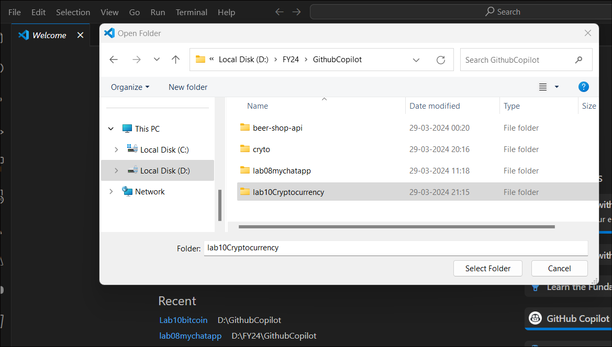
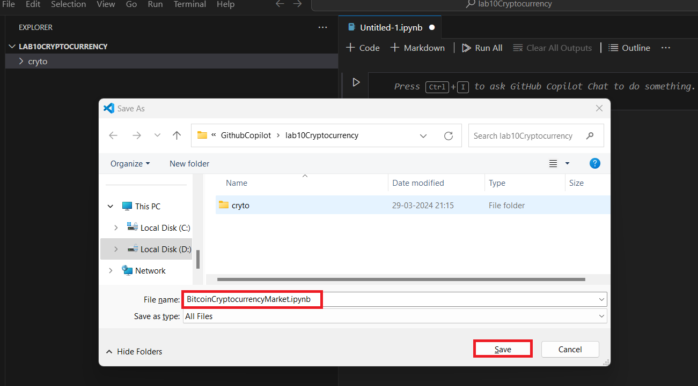
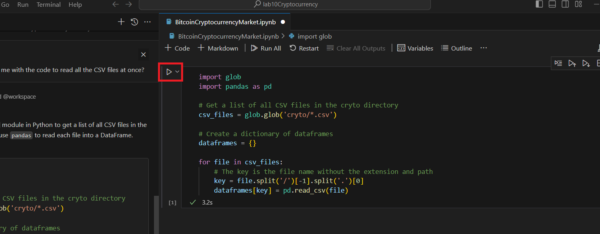
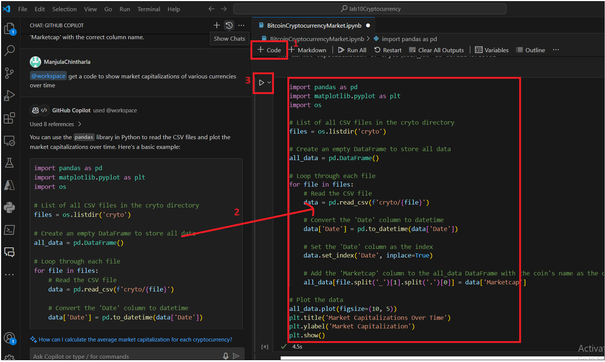

# **Lab 10 - Exploring the Cryptocurrency Market with the help of Github Copilot**

##  Introduction

Crytpocurrencies are digital currencies that use cryptography for
security and are powered by blockchain technology. Bitcoin, first
released as open-source software in 2009, is the first decentralized
cryptocurrency. Since the release of bitcoin, over 6,000 altcoins
(alternative variants of bitcoin, or other cryptocurrencies) have been
created.

## Instructions

1.  Use Copilot Chat to create a new notebook in your project. Use
    command /newnotebook and name it as "Bitcoin Cryptocurrency Market".

2.  Use Copilot and Copilot Chat to develop the exercise and support
    your learning.

## EXERCISE

The objective of this project is to explore the Cryptocurrency Market.
The dataset is obtained from
\[Kaggle\](https://www.kaggle.com/sudalairajkumar/cryptocurrencypricehistory).
The dataset has one csv file for each currency. Price history is
available on a daily basis from April 28, 2013. This dataset has the
historical price information of some of the top crypto currencies by
market capitalization. The dataset contains the following columns:

\- Date : date of observation

\- Open : Opening price on the given day

\- High : Highest price on the given day

\- Low : Lowest price on the given day

\- Close : Closing price on the given day

\- Volume : Volume of transactions on the given day

\- Market Cap : Market capitalization in USD

### Some of the questions which could be inferred from this dataset are:

How did the historical prices / market capitalizations of various
currencies change over time?

How big is Bitcoin compared with the rest of the cryptocurrencies

Predicting the future price of the currencies

Which currencies are more volatile and which ones are more stable?

How does the price fluctuations of currencies correlate with each other?

Seasonal trend in the price fluctuations

**INSTRUCTIONS**

1.  Create a folder in your directory with the name
    !!**lab10**Cryptocurrency!!

> 

2.  Copy the **cryto** folder from **Labfiles** to the
    **lab10Cryptocurrency**

> 

3.  Open Visual Studio Code from the Windows Start menu and click on
    **File -&gt; Open folder**. Open **lab10Cryptocurrency** folder from
    your directory.

> 
>
> 

4.  Press **Ctrl +Alt +I** to open **Github Copilot Chat.**

5.  Enter below prompt to get the steps to create Notebook.

Copilot Chat Prompt

!!@workspace Use command /newnotebook and name it as "Bitcoin
Cryptocurrency Market".!!

6.  You can see the Copilot helping you with instructions. Follow the
    steps and create the notebook.

7.  Follow the steps and create a Notebook.

-   Press **Ctrl+Shift+P** to open the command palette.

-   Type  and select !!**Jupyter: Create New Blank Notebook!!** and
    press **Enter**.

-   Next, select a kernel using the kernel picker in the top right.
    Select the environment as Python.

-   Once the new notebook is created, press **ctrl + S**, Project folder
    open to save the the file. Enter the file name
    as !!**BitcoinCryptocurrencyMarket.ipynb!! and save it.**.

2\. Use Copilot and Copilot Chat to develop the exercise and support
your learning.

**Task 1 : Import Required Libraries**

1.  Press **Ctrl +Alt+I** to open Github Copilot and ask the below
    prompt.

!!@workspace create a project is to explore the Cryptocurrency Market.
The dataset is obtained
from [Kaggle](vscode-file://vscode-app/c:/Users/ManjulaChintharla/AppData/Local/Programs/Microsoft%20VS%20Code/resources/app/out/vs/code/electron-sandbox/workbench/workbench.html).
The dataset has one csv file for each currency. Price history is
available on a daily basis from April 28, 2013. This dataset has the
historical price information of some of the top cryptocurrencies by
market capitalization.!!

2.  Review the response. The copilot says to import packages and read
    all CSV files.

3.  We don’t want to repeat the same line of code for each file. Let's
    ask Copilot to give the code to load all the files at once. The
    copilot responds with code.

> 

# **Task 2 : Load the Dataset**

1.  Ask Copilot how to read all the CSV file’s data at once.

Copilot Chat Prompt

!!@workspace can you help me with the code to read all the CSV files at
once?!!

2.  Run the code now. This code import required libraries and get a list
    of CSV from directory and read data from all the CSV files.

### Task 3 : Understanding the Data

1.  Enter the below prompt to know how historical prices/market
    capitalizations of various currencies change over time.

!!@workspace get a code to show market capitalizations of various
currencies!!

> 

2.  Copilot generates the code To show the market capitalizations of
    various currencies, we need to iterate over
    the dataframes dictionary and print the last market cap value from
    each DataFrame.Copy the code into the kernel and run it.You can see
    market capitalizations of all curriencies.

3.  If we want to see the graph of the historical prices / market
    capitalizations of various currencies change over time.Copilot
    generates code to plot the market capitalization of various
    currencies over a time.

> !!@workspace get a code to show market capitalizations of various
> currencies over time!!

4.  Open new Code kernel and copy the code into it and then run it.

5.  Run the below prompt to know How big is Bitcoin compared with the
    rest of the cryptocurrencies. Copilot gives basic code. You can
    expand/prompt to get the code to compare with all the currencies and
    print.

> **Copilot Chat Prompt**
>
> !!@workspace generate a code for market capitalization of a
> cryptocurrency by multiplying the current price of the cryptocurrency
> by the total supply.!!
>
> 

6.  Copy the code from the Copilot chat to the new kernel code and run
    it.

> 

7.  Ask Copilot to generate a code to print the future price of
    currencies. Copilot suggests that we can use machine learning models
    like Linear Regression, Decision Tree Regressor, or LSTM (Long Short
    Term Memory.Copilot shares the code using Linear Regression in
    Python with the sklearn library:

> **Copilot Chat Prompt**
>
> !!@workspace generate code to Predict the future price of the
> currencies!!
>
> 

8.  Copy the code to new kernel code and run it.

This code will train a Linear Regression model on the historical price
data of Bitcoin and use it to predict the closing price based on the
high, low, open prices, and volume.

9.  Replace **'cryto/coin\_Bitcoin.csv'** with the path to any other
    currency data file in your workspace to predict prices for that
    currency and run it.

10. Ask Copilot to generate code to print more volatile currencies:

> **Copilot Chat Prompt**
>
> !!@workspace generate code to print more volatile currencies!!
>
> 

11. Red the instructions from Copilot update the code with the correct
    directory and column names and then run it.

12. Ask Copilot to generate code to print more stable currencies:

To print more stable currencies, we need toread the CSV file, calculate
the standard deviation of the 'Close' prices for each currency, and then
print the currencies with the lowest standard deviations

> **Copilot Chat Prompt**
>
> !!@workspace generate code to print more stable currencies!!

13. Copy the code to new kernel code, update the column names and run it
    You can encounter errors. Dont worry, we will take Copilot help to
    fix them

14. Copy the error and Ask the copilot like the below prompt “
    @workspace /fix………”

15. Copilot generates the code with a fix. Copy the code to the new
    kernel code and run it.

16. Ask Copilot to generate code to show the price fluctuations of
    currencies correlate with each other

> **Copilot Chat Prompt**
>
> !!@workspace generate code to show price fluctuations of currencies
> correlate with each other!!

17. Copy the code to new code kernel and run it.

18. Ask Copilot to generate code to show Seasonal trend in the price
    fluctuations

> **Copilot Chat Prompt**
>
> !!@workspace generate to code to plot Seasonal trend in the price
> fluctuations!!

19. Copy the code to new kernel and run it .

20. Got the error ? Don’t worry Copy the error and ask Copilot as
    @Workspace /fx ..error message.. . It gives you the fix for the
    error.

21. Install the required library .Open new kernel and run below command

!!%pip install statsmodels!!

22. Restart the kernel and run the code to plot Seasonal trend in the
    price fluctuations

