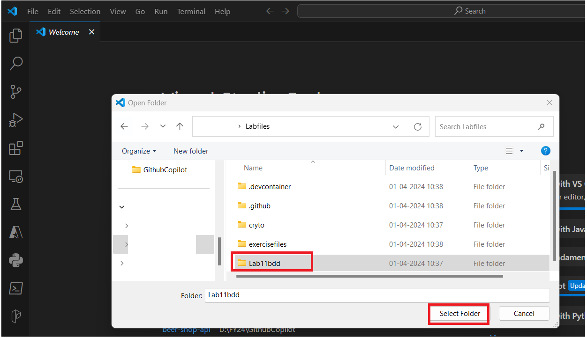
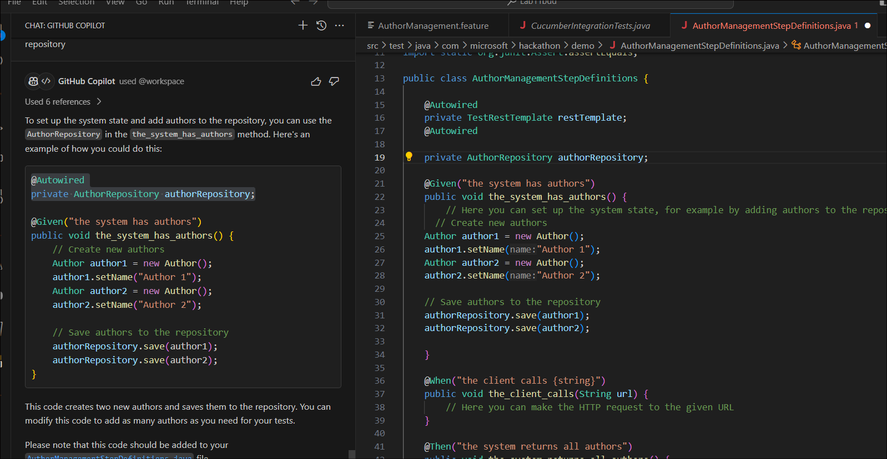
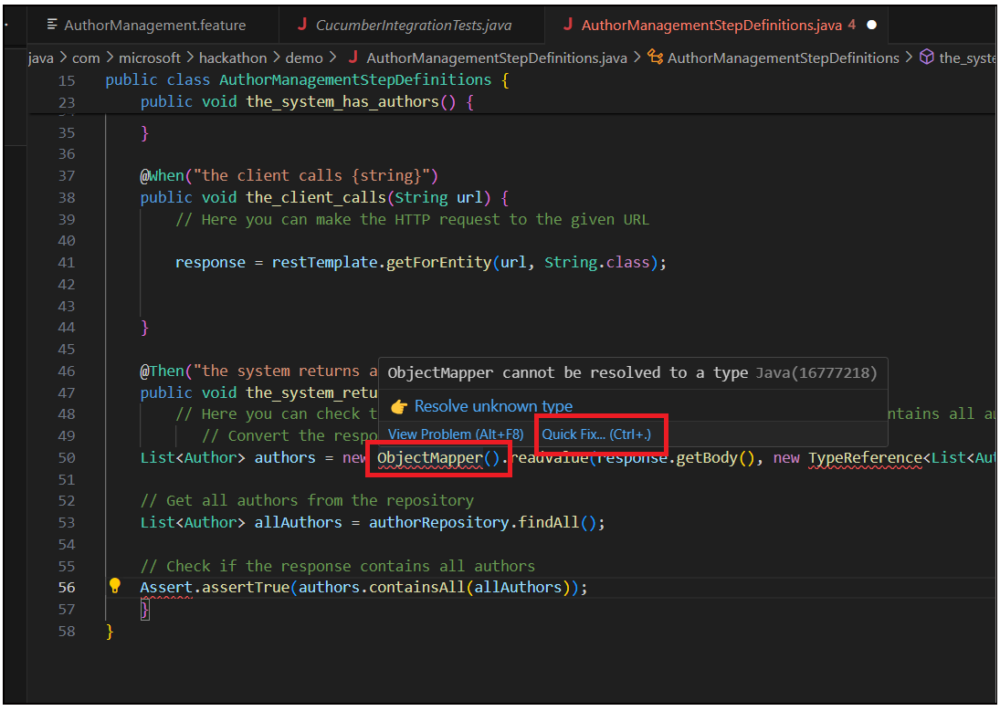
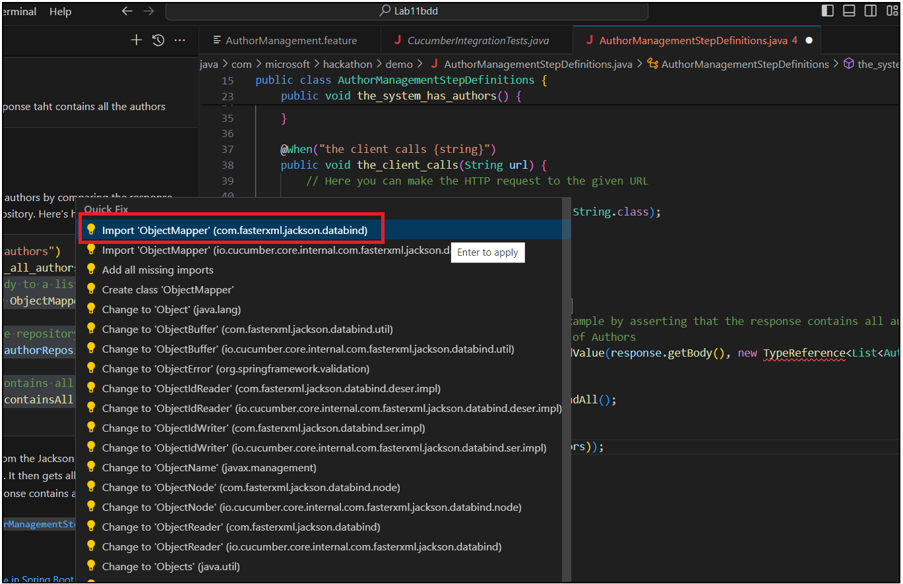

**Lab 12 - Behavior Driven Development (BDD) with the help of Github
Copilot**

**Introduction**

Behavior Driven Development (BDD) is a software development process that
emerged from Test Driven Development (TDD). BDD is a refinement of TDD
and is intended to make TDD and Agile development more accessible and
intuitive to newcomers and experts alike.

This challenge is intended to utilize Github Copilot to help you write
BDD tests for the following user story:

As a user, I want to be able to interact with the Author REST API
endpoints so that I can manage authors in the system. This includes
being able to create a new author, update an existing author's details,
retrieve details about a specific author or all authors, and delete an
author from the system. An Author has an id and a name.

This user story has already a working implementation in
the [*AuthorController.java*](https://github.com/microsoft/CopilotHackathon/blob/main/challenges/bdd/src/main/java/com/microsoft/hackathon/demo/controller/AuthorController.java) file.

**Requirement**

You have is to write BDD tests for the user story above and all the test
must pass based on the implementation in
the [*AuthorController.java*](https://github.com/microsoft/CopilotHackathon/blob/main/challenges/bdd/src/main/java/com/microsoft/hackathon/demo/controller/AuthorController.java) file.

**Hints**

Use Copilot chat to help you define the features and scenarios for the
user story. Consider using
the [*Gherkin*](https://cucumber.io/docs/gherkin/) syntax to define the
feature and scenarios and use
the [*Cucumber*](https://cucumber.io/docs/cucumber/) framework to run
the tests.

**Task 1 : Creating BDD tests**

1.  Launch Visual Studio Code from VM.

2.  Click **on File-&gt; Open Folder.** Go to the **C:\\Labfiles** and
    select the **lab11bdd** folder.

> 

3.  Select the check box and click on **Yes, I trust the author.**

4.  Ask Copilot to define features and scenarios for the user story
    implemented in the AuthorController.java file. Copilot defines
    features and scenarios for the implemented code.

!! @workspace define features and scenarios for the user story
implemented in the AuthorController.java file!!

5.  Ask **Copilot** to create file to manage authors using Gherkin
    syntax.

!!@workspace define manage authors using Gherkin syntax!!

6.  This feature file should be placed in
    the **src/test/resources/features** directory as per the
    configuration
    in [**CucumberIntegrationTests.java**](vscode-file://vscode-app/c:/Users/ManjulaChintharla/AppData/Local/Programs/Microsoft%20VS%20Code/resources/app/out/vs/code/electron-sandbox/workbench/workbench.html).
    The next step would be to implement the step definitions for these
    scenarios.

7.  Click on Terminal -&gt; New terminal and run the below commands.

> !!cd “src/test”!!

!!mkdir resources!!

!!cd resources!!

!!mkdir features !!

!!New-Item features/AuthorManagement.feature!!

8.  Click on Explorer .Open **AuthorManagement.feature from
    sc/test/resources/features .** Copy the feature generated in Copilot
    and save the rile.

> 

9.  Cucumber tests are written in a BDD style, and they are usually used
    for testing the system as a whole, or at least larger parts of it,
    rather than individual units of code. They are written in
    a .feature file using **Gherkin syntax**, and then linked to Java
    code using annotations.

10. Click on **Explorer**. Create a new file
    !!AuthorManagementStepDefinitions.java!! under
    the **src/test/java/com/microsoft/hackathon/demo/** directory.

> 

11. Ask in Copilot chat to generate a cucumber test for Get all authors
    scenario

!!@workspace cucumber tests for Get all authors scenario!!

12. Copy the code to **AuthorManagementStepDefinitions.java** and save
    it.

13. Ask Copilot to share the code to add authors to the repository.

!!@workspace get a code to set up the system state, and add authors to
the repository!!

14. Update **AuthorManagementStepDefinitions.java** with creating author
    and save author to repository code.

15. Ask Copilot to get

> !!@workspace get a code to make the HTTP request to the given URL!!
>
> 

16. Update the code and save the file

17. Ask Copilot to get the list of the authors

> !! @workspace get a code to check the response taht contains all the
> authors!!
>
> 
>
> 18, Update the code in the file.

18. Do you see errors? Hover on the error and select **QuicknFix**.

19. Select the import ‘List’ option from the list of fixes.

20. Hover on **ObjecgtMapper** and select **Quick Fix**

> 

21. Click on the **Import** **ObjectMapper** option.

22. Hove on TypeReference-&gt; Quick Fix and select to import
    TypeReference

23. Hove on **TypeReference** again and select **Quick Fix.** Select
    **Fix with Copilot**.

> 

24. Type Assert is deprecated in JAVA. Ask Copilot for the fix.

!!@workspace /fix The type Assert is deprecated!!

25. Update the file with the Assertion line of code.

26. Hover on Assertions -&gt;Quick fix and import it.

27. Fix all the issues with the help of Copilot.

Task : Run tests

1.  To run the tests in your Maven project, use the !!**mvn
    test!!** command in terminal. This command will run all unit tests
    in your project.

> 
>
> 
