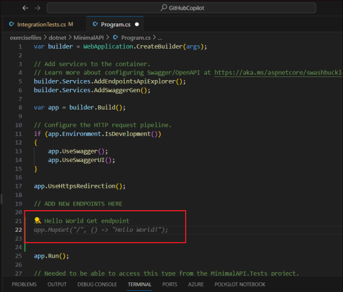
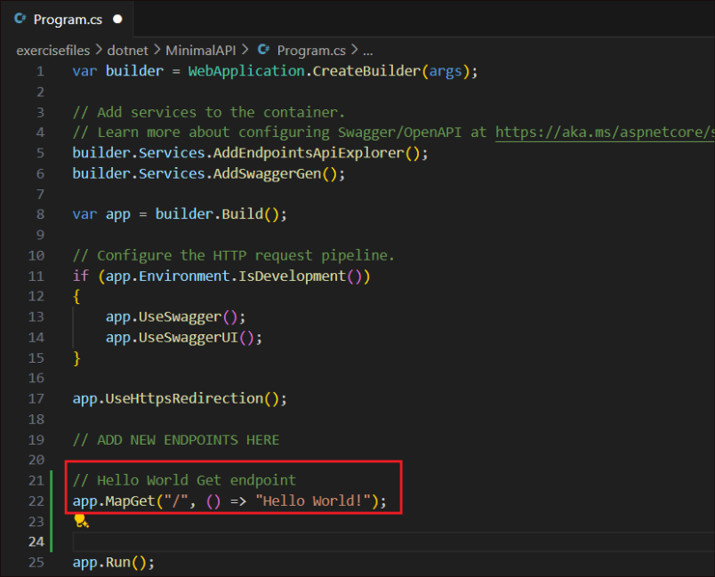

# **Lab 04 - Activate GitHub Copilot using Nodejs**

**Objective:**

This lab is to help understand the Demo project for running labs to
evaluate Copilot viability.

## **Exercise 1: Introduction**

1.  From the Visual Studio, open **nodeserver.js** from the
    exercisefiles -&gt; node.

2.  We need to start coding for the node..js server that will expose a
    method call “get” that will return the value of the key passed in
    the query string. Let us use the Copilot to help us with this.

3.  Press **Ctrl+I** and paste the below commands for the Copilot to
    generate the code and hit **Send**.

**// write a nodejs server that will expose a method call "get" that
will return the value of the key passed in the query string**

**// example: http://localhost:3000/get?key=hello**

**// if the key is not passed, return "key not passed"**

**// if the key is passed, return "hello" + key**

**// if the url has other methods, return "method not supported"**

**// when server is listening, log "server is listening on port 3000"**

4.  The Copilot generates the code and displays. Click on **Accept** to
    accept it.

5.  Right click on the **node** folder and select **Open in Integrated
    Terminal**.

6.  Once the terminal is opened, execute the below command from it.

!!**mocha test.js**!!

7.  You should get a result as **1 Passing** as in the screenshot below.

8.  This is the unit test for the method in the nodeserver.js and it has
    passed.

9.  We will continue adding different methods to the server using the
    Copilot.

## **Exercise 2: Building new functionalities**

The exercise consists of building a web server using Nodejs that serves
the request of various functionality.

1.  Add the **DaysBetweenDates** functionality request that the server
    must attend.

2.  Press **Enter** after the **if** condition – **pathname == ‘/get’**
    ends.

3.  Press **Ctrl+I** to open the Copilot inline feature, enter the
    following and click on **Send**.

> **/DaysBetweenDates:**
>
> **Calculate days between two dates**
>
> **receive by query string 2 parameters date1 and date 2, and calculate
> the days between those two dates.**

**Reference Code:**

if (req.url.startsWith('/DaysBetweenDates')) {

//calculate days between two dates

//get dates from querystring

var queryData = url.parse(req.url, true).query;

var date1 = queryData.date1;

var date2 = queryData.date2;

//convert dates to milliseconds

var date1\_ms = Date.parse(date1);

var date2\_ms = Date.parse(date2);

//calculate difference in milliseconds

var difference\_ms = date2\_ms - date1\_ms;

//convert to days and return

res.end(Math.round(difference\_ms / 86400000) + " days");

}

4.  Copilot generates the code. Click on **Accept** to accept the code.
    Note that the generated code is an **else if** block where in the
    request is **DaysBetweenDates**.

5.  Click on **Enter** after the **DaysBetweenDates** block.

6.  Enter the below comment block and hit **Enter**.

**/\***

**/Validatephonenumber:**

**Receive by querystring a parameter called phoneNumber**

**validate phoneNumber with proper Spanish format, for example
34666666666**

**if phoneNumber is valid return "valid"**

**if phoneNumber is not valid return "invalid"**

**\*/**

**Reference Code:**

else if (req.url.startsWith('/Validatephonenumber')) {

//get phoneNumber var from querystring

var queryData = url.parse(req.url, true).query;

var phoneNumber = queryData.phoneNumber;

//validate phoneNumber with Spanish format

var regex = /^(\\+34|0034|34)?\[ -\]\*(6|7)\[ -\]\*(\[0-9\]\[
-\]\*){8}$/;

//if phoneNumber is valid return "valid"

if (regex.test(phoneNumber)) {

res.end("valid");

}

//if phoneNumber is not valid return "invalid"

else {

res.end("invalid");

}

}

7.  The Copilot generates the code. Click **Accept** to accept the code.

8.  Click **Enter** after the **Validatephonenumber** block to add the
    next block of code.

9.  Copy and paste the below text into the js file.

> **/\***
>
> **/ValidateSpanishDNI:**
>
> **Receive by querystring a parameter called dni**
>
> **calculate DNI letter**
>
> **if DNI is valid return "valid"**
>
> **if DNI is not valid return "invalid"**
>
> **\*/**
>
> **Reference Code:**
>
> else if (req.url.startsWith('/ValidateSpanishDNI')) {
>
> var queryData = url.parse(req.url, true).query;
>
> var dni = queryData.dni;
>
> // calculate DNI letter
>
> var dniLetter = dni.charAt(dni.length - 1);
>
> var dniNumber = dni.substring(0, dni.length - 1);
>
> var dniLetterCalc = "TRWAGMYFPDXBNJZSQVHLCKE".charAt(dniNumber % 23);
>
> //if DNI is valid return "valid"
>
> if (dniLetter == dniLetterCalc) {
>
> res.end("valid");
>
> }
>
> //if DNI is not valid return "invalid"
>
> else {
>
> res.end("invalid");
>
> }
>
> }
>
> 

10. Once the above content is pasted, the Copilot generates the code
    which is displayed just below the comment. Click on **Accept** to
    accept the code.

11. Open Copilot chat from the left navigation pane.

12. Paste the below content into the chat and click on the **Send**
    button.

> **/ReturnColorCode:**
>
> **Receive by querystring a parameter called color**
>
> **read colors.json file and return the rgba field**
>
> **get color var from querystring**
>
> **iterate for each color in colors.json to find the color**
>
> **return the code.hex field**
>
> **Reference code:**

else if (req.url.startsWith('/ReturnColorCode')) {

//read colors.json file and return the rgba field

var colors = fs.readFileSync('colors.json', 'utf-8');

var colorsObj = JSON.parse(colors);

//get color var from querystring

var queryData = url.parse(req.url, true).query;

var color = queryData.color;

var colorFound = "not found";

//for each color in colors.json

for (var i = 1; i &lt; colorsObj.length; i++) {

//if color is found return the color code

if (colorsObj\[i\].color == color) {

colorFound = colorsObj\[i\].code.hex;

}

}

res.end(colorFound);

}

> **Note:** Copilot will use by default the open file as context in
> order to generate the suggestion.

13. Keep the cursor after the **ValidateSpanishDNI** block and click on
    the Insert at cursor icon in the chat. This **copies** the Copilot
    generated code from the chat to the server js file at the mentioned
    location.

14. Check for errors if any. In this generated code, there is an error
    since there is a constant declaration in between the else if blocks.

15. Press **Ctrl+I** to open the Copilot Inline, type in !!**/fix**!!
    and click on the **Send** button.

16. Copilot generates a solution if it can find one. Accept or discard
    the solution based on how accurate the solution is.

17. Here, we are moving the constant declaration inside the else if
    block of returncolors to resolve the error.

**Important:** The code and the resolution might be different for you
based on the one that the Copilot generates.

18. After the added block, press **Ctrl+I** to open the Copilot inline
    feature, paste the below content and click on **Send**.

**/TellMeAJoke:**

**Make a call to the joke api and return a random joke using axios
(<https://official-joke-api.appspot.com/random_joke>)**

Reference code:

else if (req.url.startsWith('/TellMeAJoke')) {

//make a call to the joke api and return a random joke using axios

const axios = require('axios');

axios.get('https://official-joke-api.appspot.com/random\_joke')

.then(function (response) {

// handle success

res.end(response.data.setup + " " + response.data.punchline);

}

)

.catch(function (error) {

// handle error

console.log(error);

})

.then(function () {

// always executed

});

}

19. Click on **Accept** to accept the Copilot generated code.

20. After the generated code block, press **Ctrl+I**, enter the below
    text and click on **Send** button.

**/MoviesByDirector:**

**Receive by querystring a parameter called director**

**Make a call to the movie api and return a list of movies of that
director using axios**

**Return the full list of movies**

**Reference code:**

//method that gets the name of a director and retrieves from an api the
list of movies of that director

else if (req.url.startsWith('/MoviesByDirector')) {

//get a director name from querystring

var queryData = url.parse(req.url, true).query;

var director = queryData.director;

//make a call to the movie api omdbapi.com and return a list of movies
of that director using axios

const axios = require('axios');

axios.get('http://www.omdbapi.com/?apikey=XXXXXXX&s=' + director)

.then(function (response) {

//return the full list of movies

var movies = "";

for (var i = 0; i &lt; response.data.Search.length; i++) {

movies = movies + response.data.Search\[i\].Title + ", ";

}

res.end(movies);

}

)

.catch(function (error) {

// handle error

console.log(error);

}

)

.then(function () {

// always executed

}

);

}

21. Click on **Accept** to accept the code.

22. After the generated code block, press **Ctrl+I**, enter the below
    text and click on **Send** button.

**/ParseUrl:**

**Retrieves a parameter from querystring called someurl**

**Parse the url and return the protocol, host, port, path, querystring
and hash**

**Return the parsed host**

**Reference code:**

> //If url equals to ParseUrl
>
> else if (req.url.startsWith('/ParseUrl')) {
>
> //retrieves a parameter from querystring called someurl
>
> var queryData = url.parse(req.url, true).query;
>
> var someUrl = queryData.someurl;
>
> //parse the url and return the protocol, host, port, path, querystring
> and hash
>
> var urlObj = new URL(someUrl);
>
> var protocol = urlObj.protocol;
>
> var host = urlObj.host;
>
> var port = urlObj.port;
>
> var path = urlObj.pathname;
>
> var querystring = urlObj.search;
>
> var hash = urlObj.hash;
>
> //return the parsed host
>
> res.end("host: " + host);
>
> }

23. Click on **Accept** to accept the code.

24. After the generated code block, press **Ctrl+I**, enter the below
    text and click on **Send** button.

**/GetFullTextFile:**

**Read \`sample.txt\`\` and return lines that contains the word
"Fusce"**

**Reference code:**

else if (req.url.startsWith('/GetFullTextFile')) {

//read sample.txt and return lines that contains the word "Fusce"

var text = fs.readFileSync('sample.txt', 'utf-8');

var lines = text.split("\\r");

var linesFound = "";

for (var i = 1; i &lt; lines.length; i++) {

if (lines\[i\].includes("Fusce")) {

linesFound = linesFound + lines\[i\] + ", ";

}

}

res.end(linesFound);

}

**NOTE:** Becareful with this implementation, since this normally reads
the full content of the file before analizing it, so memory usage is
high and may fail when files are too big.

25. Click on **Accept** to accept the code.

26. After the generated code block, press **Ctrl+I**, enter the below
    text and click on **Send** button.

**/GetLineByLinefromtTextFile:**

**Read sample.txt line by line**

**Create a promise to read the file line by line, and return a list of
lines that contains the word "Fusce"**

**Return the list of lines**

**Reference code:**

else if (req.url.startsWith('/GetLineByLinefromtTextFile')) {

//read sample.txt line by line

var lineReader = require('readline').createInterface({

input: require('fs').createReadStream('sample.txt')

});

//create a promise to read the file line by line, and return a list of
lines that contains the word "Fusce"

var promise = new Promise(function (resolve, reject) {

var lines = \[\];

lineReader.on('line', function (line) {

if (line.includes("Fusce")) {

lines.push(line);

}

});

lineReader.on('close', function () {

resolve(lines);

});

});

//return the list of lines

promise.then(function (lines) {

res.end(lines.toString());

});

}

27. Click on **Accept** to accept the code.

28. After the generated code block, press **Ctrl+I**, enter the below
    text and click on **Send** button.

**/CalculateMemoryConsumption:**

**Return the memory consumption of the process in GB, rounded to 2
decimals**

**Reference code:**

else if (req.url.startsWith('/CalculateMemoryConsumption')) {

//return the memory consumption of the process in GB, rounded to 2
decimals

var memory = process.memoryUsage().heapUsed / 1024 / 1024;

res.end(memory.toFixed(2) + " GB");

}

29. Click on **Accept** to accept the code.

30. After the generated code block, press **Ctrl+I**, enter the below
    text and click on **Send** button.

**/RandomEuropeanCountry:**

**Make an array of european countries and its iso codes**

**Return a random country from the array**

**Return the country and its iso code**

**Reference code:**

else if (req.url.startsWith('/RandomEuropeanCountry')) {

//make an array of european countries and its iso codes

var countries = \[

{ country: "Italy", iso: "IT" },

{ country: "France", iso: "FR" },

{ country: "Spain", iso: "ES" },

{ country: "Germany", iso: "DE" },

{ country: "United Kingdom", iso: "GB" },

{ country: "Greece", iso: "GR" },

{ country: "Portugal", iso: "PT" },

{ country: "Romania", iso: "RO" },

{ country: "Bulgaria", iso: "BG" },

{ country: "Croatia", iso: "HR" },

{ country: "Czech Republic", iso: "CZ" },

{ country: "Denmark", iso: "DK" },

{ country: "Estonia", iso: "EE" },

{ country: "Finland", iso: "FI" },

{ country: "Hungary", iso: "HU" },

{ country: "Ireland", iso: "IE" },

{ country: "Latvia", iso: "LV" },

{ country: "Lithuania", iso: "LT" },

{ country: "Luxembourg", iso: "LU" },

{ country: "Malta", iso: "MT" },

{ country: "Netherlands", iso: "NL" },

{ country: "Poland", iso: "PL" },

{ country: "Slovakia", iso: "SK" },

{ country: "Slovenia", iso: "SI" },

{ country: "Sweden", iso: "SE" },

{ country: "Belgium", iso: "BE" },

{ country: "Austria", iso: "AT" },

{ country: "Switzerland", iso: "CH" },

{ country: "Cyprus", iso: "CY" },

{ country: "Iceland", iso: "IS" },

{ country: "Norway", iso: "NO" },

{ country: "Albania", iso: "AL" },

{ country: "Andorra", iso: "AD" },

{ country: "Armenia", iso: "AM" },

{ country: "Azerbaijan", iso: "AZ" },

{ country: "Belarus", iso: "BY" },

{ country: "Bosnia and Herzegovina", iso: "BA" },

{ country: "Georgia", iso: "GE" },

{ country: "Kazakhstan", iso: "KZ" },

{ country: "Kosovo", iso: "XK" },

{ country: "Liechtenstein", iso: "LI" },

{ country: "Macedonia", iso: "MK" },

{ country: "Moldova", iso: "MD" },

{ country: "Monaco", iso: "MC" },

{ country: "Montenegro", iso: "ME" },

{ country: "Russia", iso: "RU" },

{ country: "San Marino", iso: "SM" },

{ country: "Serbia", iso: "RS" },

{ country: "Turkey", iso: "TR" },

{ country: "Ukraine", iso: "UA" },

{ country: "Vatican City", iso: "VA" }

\];

//return a random country from the array

var randomCountry = countries\[Math.floor(Math.random() \*
countries.length)\];

//return the country and its iso code

res.end(randomCountry.country + " " + randomCountry.iso);

}

31. Click on **Accept** to accept the code.

## **Exercise 3: Document the code**

Documenting code is always a boring and painful task. However, we can
use Copilot to document it for us. In the chat, ask Copilot to document
the nodeserver.js file.

1.  **Select all** in the **nodeserver.js** file.

2.  From the Copilot chat, enter !!**document the nodeserver.js file**!!
    and click Send.

3.  The Copilot generates a detailed documentation of the file.

## **Exercise 4: Building tests**

We will create automated tests to check that the functionality of the
previous endpoints is correctly implemented. The tests should be
together in the test.js file.

You can leverage Copilot to run the tests. There is a /tests command
that you can directly run from Copilot Chat or by selecting the piece of
code you want to create tests for and using the Copilot inline feature.

1.  Open the test.js file.

2.  Click on **Enter** after the existing **it** block.

3.  Enter the below text and click **Enter**.

**//add test to test DaysBetweenDates**

4.  This generates the unit test block for **DaysBetweenDates**. Click
    on **Accept** to accept the code.

5.  From the terminal, execute the below command !!**mocha test.js**!!

6.  Enter the below text **//add test to check validatephoneNumber** and
    click **Enter**.

7.  Click on **Accept** to accept the Copilot generated code.

8.  From the terminal, execute the command, !!**mocha test.js**!!. Check
    that the validate phone number has passed.

9.  Enter the below text and hit **Enter**.

!!**//write test to validate validateSpanishDNI**!!

10. Accept the Copilot generated text.

11. From the terminal, execute !!**mocha test.js**!! and check that the
    ValidateSpanishDNI has passed.

**Reference Code:**

//write npm command line to install mocha

//npm install --global mocha

//command to run this test file

//mocha test.js

const assert = require('assert');

const http = require('http');

const server = require('./nodeserver');

describe('Node Server', () =&gt; {

it('should return "key not passed" if key is not passed', (done) =&gt; {

http

.get('http://localhost:3000/Get' , (res) =&gt; {

let data = '';

res.on('data', (chunk) =&gt; {

data += chunk;

});

res.on('end', () =&gt; {

assert.equal(data, 'key not passed');

done();

});

});

});

it('should return the value of the key if key is found', (done) =&gt; {

http.get('http://localhost:3000/Get?key=world', (res) =&gt; {

let data = '';

res.on('data', (chunk) =&gt; {

data += chunk;

});

res.on('end', () =&gt; {

assert.equal(data, 'hello world');

done();

});

});

});

//add test to check validatephoneNumber

it('should return "valid" if phoneNumber is valid', (done) =&gt; {

http.get('http://localhost:3000/Validatephonenumber?phoneNumber=34666666666',
(res) =&gt; {

let data = '';

res.on('data', (chunk) =&gt; {

data += chunk;

});

res.on('end', () =&gt; {

assert.equal(data, 'valid');

done();

});

});

});

//write test to validate spanish DNI

it('should return "valid" if spanish DNI 86471508H is valid', (done)
=&gt; {

http.get('http://localhost:3000/ValidateSpanishDNI?dni=86471508H', (res)
=&gt; {

let data = '';

res.on('data', (chunk) =&gt; {

data += chunk;

});

res.on('end', () =&gt; {

assert.equal(data, 'valid');

done();

});

});

});

//write test to validate spanish DNI

it('should return "valid" if spanish DNI 24153149K is valid', (done)
=&gt; {

http.get('http://localhost:3000/ValidateSpanishDNI?dni=24153149K', (res)
=&gt; {

let data = '';

res.on('data', (chunk) =&gt; {

data += chunk;

});

res.on('end', () =&gt; {

assert.equal(data, 'valid');

done();

});

});

});

//write test to validate spanish DNI

it('should return "valid" if spanish DNI 12345678A is invalid', (done)
=&gt; {

http.get('http://localhost:3000/ValidateSpanishDNI?dni=12345678A', (res)
=&gt; {

let data = '';

res.on('data', (chunk) =&gt; {

data += chunk;

});

res.on('end', () =&gt; {

assert.equal(data, 'invalid');

done();

});

});

});

//write test for returnColorCode

it('should return "red" if color is red', (done) =&gt; {

http.get('http://localhost:3000/ReturnColorCode?color=red', (res) =&gt;
{

let data = '';

res.on('data', (chunk) =&gt; {

data += chunk;

});

res.on('end', () =&gt; {

assert.equal(data, '\#FF0000');

done();

});

});

});

//write test for daysBetweenDates

it('should return "1" if dates are 2020-01-01 and 2020-01-02', (done)
=&gt; {

http.get('http://localhost:3000/DaysBetweenDates?date1=2020-01-01&date2=2020-01-02',
(res) =&gt; {

let data = '';

res.on('data', (chunk) =&gt; {

data += chunk;

});

res.on('end', () =&gt; {

assert.equal(data, '1 days');

done();

});

});

});

});

## **Exercise 5: Create a Dockerfile**

1.  Open the **dockerfile** from the **node** folder.

2.  The file will consist of comments on how it should get populated.

3.  Press **Ctrl+I** and type !!**/fix**!!. Click on the **Send** icon.

4.  The Copilot will generate the Docker file contents. Click on
    **Accept**.

5.  From the terminal, execute the below command

!!**docker build -t mynodeapp .**!!

This is to build the image and tag it as mynodeapp.

6.  Run the docker in port **4000** using the below command.

!!**docker run -p 4000:3000 -d mynodeapp**!!

7.  Open the Docker daemon to see that the application has been
    containerized and running in it.

**Summary:**

In this lab, we have learnt how to use the Copilot in a node project
