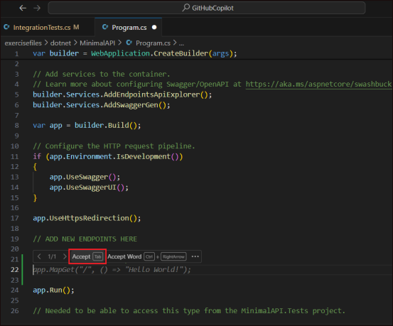
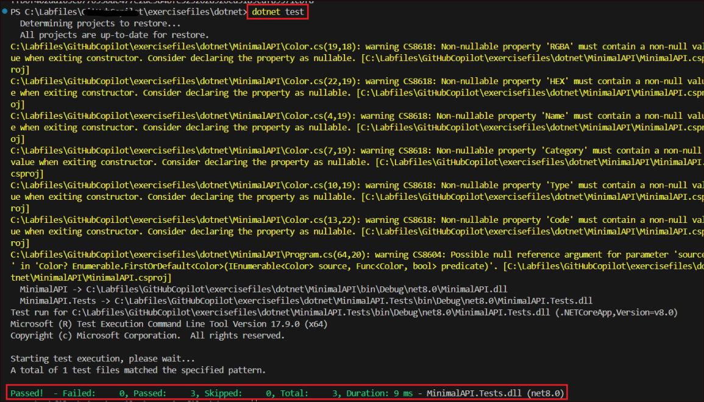
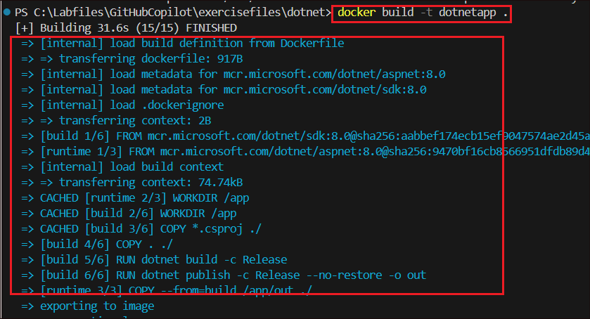

# **Lab 03 - Create a Minimal WebAPI using .NET and a corresponding Docker image with GitHub Copilot**

**Objective:**

The goal is to create a Minimal WebAPI using .NET 7.0 and a
corresponding Docker image with the help of GitHub Copilot. Here, we use
GitHub Copilot as much as possible.

Try different things and see what GitHub Copilot can do for you, like
generating a Dockerfile or a class, add comments, etc.

## **Exercise 0: Set up the project in VS Code**

1.  Open !!**Visual Studio Code**!! from the **Start** menu.

2.  Select **File** -&gt; **Open Folder…**

3.  Select **CopilotHackathon** folder from **C:\\Labfiles** and click
    on **Select Folder**.

4.  Click on **Yes, I trust the authors**.

## **Exercise 1: Introduction**

**Note:** The Copilot generated code might differ at different
executions. In the steps where the code generation are involved below,
we have given the **Reference code**. Please use that to cross check the
correctness of the Copilot generated code or to resolve errors if any.

1.  Open **Program.cs** from **dotnet** -&gt; **MinimalAPI**.

2.  Inside **MinimalAPI\\Program.cs** after the line **// ADD NEW
    ENDPOINTS HERE**(Line number 19), type !!**// Hello World Get
    endpoint**!! and press **Enter.** The Copilot will suggest the code
    in grey.

3.  Once you get the Copilot generated code, you can **accept** it or
    **discard** it. To accept, click on **Ctrl** button and the option
    bar will appear over the grey text. Another option is to simply hit
    the **Tab** key.

**Reference code :** app.MapGet("/", () =&gt; "Hello World!");

4.  The code will now look like this. **Save** the file.

5.  Right click on the **dotnet** folder and select **Open in Integrated
    Terminal**.

6.  From the terminal, execute the below command.

> **dotnet test**
>
> 

## **Exercise 2: Building new functionalities**

1.  Next to the Hello World endpoint, add **DaysBetweenDates.**

2.  Press **Ctrl+I** in order open the Copilot inline.

3.  Enter the below text and hit the **Send** button.

> **/DaysBetweenDates:**
>
> **calculate days between two dates**
>
> **receive by query string two parameters date1 and date2, and
> calculate the days between those two dates.**

4.  The Copilot now generates **code** and enters it in the
    **Program.cs** file. Once done, you will see two options to
    **Accept** or **Discard**. **Accept** the code.

5.  Once accepted, select the generated code and press **Ctrl+I.**
    Enter, !!**Convert this code into a single line**!! and hit
    **Enter**. Click on Accept once the code is converted into a single
    line.

**Reference code** - app.MapGet("/DaysBetweenDates", (DateTime date1,
DateTime date2) =&gt; (date2 - date1).Days.ToString());

6.  Enter the below statements(commented) and click on **Enter**.

Click on Accept to accept the code generated by the Copilot.

> **/\***
>
> **/validatephonenumber:**
>
> **receive by querystring a parameter called phoneNumber**
>
> **validate phoneNumber with Spanish format, for example +34666777888**
>
> **if phoneNumber is valid return true**
>
> **\*/**
>
> **Reference code:**
>
> app.MapGet("/validatephonenumber", (string phonenumber) =&gt;
> Regex.IsMatch(phonenumber, @"^(\\+\[0-9\]{9})$").ToString());

7.  Add the below text as in the Copilot inline feature, in the
    Program.cs file and hit **Enter**.

> **/validatespanishdni:**
>
> **receive by querystring a parameter called dni**
>
> **calculate DNI letter**
>
> **if DNI is valid return "valid"**
>
> **if DNI is not valid return "invalid"**
>
> In this case, you may want to see multiple solutions from Copilot to
> pick the one that best fits the way to calculate the letter. In order
> to see the firs 10 suggestions from Copilot press ctrl + enter.
>
> Accept the GitHub generated code.
>
> **Reference Code:**
>
> app.MapGet("/validatespanishdni", (string dni) =&gt; {
>
> var valid = false;
>
> if (dni.Length == 9 && int.TryParse(dni.Substring(0, 8), out int
> number))
>
> {
>
> var letters = "TRWAGMYFPDXBNJZSQVHLCKE";
>
> var letter = letters\[number % 23\];
>
> valid = dni.EndsWith(letter.ToString());
>
> }
>
> return valid ? "valid" : "invalid";
>
> });
>
> 

8.  Select **Chat** from the left pane.

9.  Enter the below text and click **Enter**.

**/returncolorcode:**

**receive by querystring a parameter called color read colors.json file
and return the rgba field get color var from querystring iterate for
each color in colors.json to find the color return the code.hex field**

10. See that the Copilot gives a detailed steps and then the generated
    **code**. Place the cursor in the Program.cs file, after the
    **validatespanishdni** code. Click on the **Insert at cursor icon**
    to paste the code into the file.

**Reference Code:**

app.MapGet("/color", (string color) =&gt;

{

var colors =
JsonSerializer.Deserialize&lt;Color\[\]&gt;(File.ReadAllText("colors.json"));

return colors.First(c =&gt; c.Name == color).Code.HEX;

});

11. Ensure that there are no errors in the generated code. If error
    exists, keep the reference code as reference and correct the code.

12. In this case, there is an error, **Color does not contain definition
    for code**.

13. The generated code is updated as below to resolve the errors.

14. Enter the below text and hit Enter and review and Accept the Copilot
    generated code.

**/\***

**/tellmeajoke:**

**Make a call to the joke api and return a random joke**

**\*/**

**Reference code:**

app.MapGet("/tellmeajoke", async () =&gt; {

var client = new HttpClient();

var response = await
client.GetAsync("https://official-joke-api.appspot.com/jokes/random");

var joke = await response.Content.ReadAsStringAsync();

return joke;

});

NOTE: This is an example where you might need to use you own knowledge
and judgement to validate that Copilot follows best practices. Just
because Copilot mimic what many developers do, doesn't always mean it's
the correct way. You might need to be extra specific in your prompt to
let Copilot know what's best practices. Hint: Pay attention to
HttpClient.

15. Copilot can help you learn new frameworks.

Enter the below text in Copilot inline and hit **Enter**.

**/parseurl:**

**Retrieves a parameter from querystring called someurl**

**Parse the url and return the protocol, host, port, path, querystring
and hash**

**Return the parsed host**

**Reference code:**

app.MapGet("/parseurl", (string someurl) =&gt; {

var uri = new Uri(someurl);

var host = uri.Host;

var protocol = uri.Scheme;

var port = uri.Port;

var path = uri.AbsolutePath;

var query = uri.Query;

var hash = uri.Fragment;

return host;

});

16. Copilot can also help with these kind of commands locally. The
    feature is called Copilot in the CLI. You can learn more information
    about this feature here.

Open Copilot Inline, enter the below text and hit **Enter**.

**/listfiles:**

**Get the current directory**

**Get the list of files in the current directory**

**Return the list of files**

**Reference code:**

app.MapGet("/listfiles", () =&gt; {

var currentDirectory = Directory.GetCurrentDirectory();

var files = Directory.GetFiles(currentDirectory);

return files;

});

17. Enter the below text in inline copilot and hit **Enter**.

> **/calculatememoryconsumption:**
>
> **Return the memory consumption of the process in GB, rounded to 2
> decimals**
>
> **Reference code:**

// Calculate memory consumption endpoint

app.MapGet("/calculatememoryconsumption", () =&gt;

{

var process = System.Diagnostics.Process.GetCurrentProcess();

var memoryUsage = process.WorkingSet64 / (1024.0 \* 1024 \* 1024); //
Convert to GB

return Math.Round(memoryUsage, 2);

}); 

18. Enter the below text in Copilot inline and hit **Enter**.

**/randomeuropeancountry:**

**Make an array of european countries and its iso codes**

**Return a random country from the array**

**Return the country and its iso code**

**Reference code:**

**// Random European Country endpoint**

**app.MapGet("/randomeuropeancountry", () =&gt;**

**{**

**var europeanCountries = new Dictionary&lt;string, string&gt;**

**{**

**{ "Albania", "AL" },**

**{ "Andorra", "AD" },**

**{ "Austria", "AT" },**

**{ "Belarus", "BY" },**

**{ "Belgium", "BE" },**

**{ "Bosnia and Herzegovina", "BA" },**

**{ "Bulgaria", "BG" },**

**{ "Croatia", "HR" },**

**{ "Cyprus", "CY" },**

**{ "Czech Republic", "CZ" },**

**{ "Denmark", "DK" },**

**{ "Estonia", "EE" },**

**{ "Finland", "FI" },**

**{ "France", "FR" },**

**{ "Germany", "DE" },**

**{ "Greece", "GR" },**

**{ "Hungary", "HU" },**

**{ "Iceland", "IS" },**

**{ "Ireland", "IE" },**

**{ "Italy", "IT" },**

**{ "Kosovo", "XK" },**

**{ "Latvia", "LV" },**

**{ "Liechtenstein", "LI" },**

**{ "Lithuania", "LT" },**

**{ "Luxembourg", "LU" },**

**{ "Malta", "MT" },**

**{ "Moldova", "MD" },**

**{ "Monaco", "MC" },**

**{ "Montenegro", "ME" },**

**{ "Netherlands", "NL" },**

**{ "North Macedonia", "MK" },**

**{ "Norway", "NO" },**

**{ "Poland", "PL" },**

**{ "Portugal", "PT" },**

**{ "Romania", "RO" },**

**{ "Russia", "RU" },**

**{ "San Marino", "SM" },**

**{ "Serbia", "RS" },**

**{ "Slovakia", "SK" },**

**{ "Slovenia", "SI" },**

**{ "Spain", "ES" },**

**{ "Sweden", "SE" },**

**{ "Switzerland", "CH" },**

**{ "Ukraine", "UA" },**

**{ "United Kingdom", "GB" },**

**{ "Vatican City", "VA" }**

**};**

**var random = new Random();**

**var index = random.Next(europeanCountries.Count);**

**var country = europeanCountries.ElementAt(index);**

**return $"{country.Key} ({country.Value})";**

**});**

## **Exercise 3: Document the code**

1.  Open the chat window.

> 

2.  Type, **Document the Program.cs file** and select **Send**.

> The GitHubCopiot generates a brief **documentation** of the
> **Program.cs** file.
>
> 

## **Exercise 4: Building tests**

1.  Open **Program.cs** file.

2.  Select the **DaysBetweenDates** endpoint, press **Ctrl+I** to open
    the Copilot inline.

In the Copilot inline, type **/tests** and click on the **Send** button.

3.  Copy the test generated.

4.  Open the IntegrationTests.cs from the MinimalAPI.Tests.

5.  Paste it in the cs file after the test block of the Hello World.
    Resolve any issues that might arise.

6.  Open the Copilot chat from the left pane.

7.  Type **/tests**, the command to create test units and hit **Enter**.
    The Copilot generates a test file. Copy its contents.

8.  Open **IntegrationTests.cs** from the **MinimalAPI.Tests**.

9.  Replace the contents of the file with the Copilot generated code and
    save.

**Important:** Check for any errors and fix it using /fix command or
manually. Use the reference code below to troubleshoot.

10. If the tests are not generated for all the endpoints, from the chat,
    specify the end point name and ask the Copilot to generate the test
    as below. Update the endpoint names according to which are updated
    and which are missing in your test.

**generate test units for moviesbydirector, parseurl, listfiles,
calculatememoryconsumption and randomeuropeancountry**

**Reference Code:**

> using System;
>
> using System.Net.Http;
>
> using System.Threading.Tasks;
>
> using Microsoft.AspNetCore.Mvc.Testing;
>
> using Xunit;
>
> public class EndpointTests :
> IClassFixture&lt;WebApplicationFactory&lt;Program&gt;&gt;
>
> {
>
> private readonly WebApplicationFactory&lt;Program&gt; \_factory;
>
> private readonly HttpClient \_client;
>
> public EndpointTests(WebApplicationFactory&lt;Program&gt; factory)
>
> {
>
> \_factory = factory;
>
> \_client = \_factory.CreateClient();
>
> }
>
> \[Fact\]
>
> public async Task Get\_HelloWorld\_ReturnsHelloWorld()
>
> {
>
> var response = await \_client.GetAsync("/");
>
> response.EnsureSuccessStatusCode();
>
> var stringResponse = await response.Content.ReadAsStringAsync();
>
> Assert.Equal("Hello World!", stringResponse);
>
> }
>
> \[Fact\]
>
> public async Task Get\_ValidatePhoneNumber\_ReturnsInvalid()
>
> {
>
> var response = await
> \_client.GetAsync("/validatephonenumber?phonenumber=123456789");
>
> response.EnsureSuccessStatusCode();
>
> var stringResponse = await response.Content.ReadAsStringAsync();
>
> Assert.Equal("False", stringResponse);
>
> }
>
> \[Fact\]
>
> public async Task Get\_ValidateSpanishDni\_ReturnsValid()
>
> {
>
> var response = await
> \_client.GetAsync("/validatespanishdni?dni=12345678Z");
>
> response.EnsureSuccessStatusCode();
>
> var stringResponse = await response.Content.ReadAsStringAsync();
>
> Assert.Equal("valid", stringResponse);
>
> }
>
> \[Fact\]
>
> public async Task Get\_Color\_ReturnsHexCode()
>
> {
>
> var response = await \_client.GetAsync("/color?color=red");
>
> response.EnsureSuccessStatusCode();
>
> var stringResponse = await response.Content.ReadAsStringAsync();
>
> Assert.Equal("\#FF0000", stringResponse); // assuming red color
> returns \#FF0000
>
> }
>
> \[Fact\]
>
> public async Task Get\_TellMeAJoke\_ReturnsJoke()
>
> {
>
> var response = await \_client.GetAsync("/tellmeajoke");
>
> response.EnsureSuccessStatusCode();
>
> var stringResponse = await response.Content.ReadAsStringAsync();
>
> Assert.NotNull(stringResponse); // assuming the joke API always
> returns a joke
>
> }
>
> \[Fact\]
>
> public async Task Get\_ParseUrl\_ReturnsHost()
>
> {
>
> var response = await
> \_client.GetAsync("/parseurl?someurl=https://www.example.com");
>
> response.EnsureSuccessStatusCode();
>
> var stringResponse = await response.Content.ReadAsStringAsync();
>
> Assert.Equal("www.example.com", stringResponse);
>
> }
>
> \[Fact\]
>
> public async Task Get\_ListFiles\_ReturnsFiles()
>
> {
>
> var response = await \_client.GetAsync("/listfiles");
>
> response.EnsureSuccessStatusCode();
>
> var stringResponse = await response.Content.ReadAsStringAsync();
>
> Assert.NotNull(stringResponse); // assuming the API always returns a
> list of files
>
> }
>
> \[Fact\]
>
> public async Task
> Get\_CalculateMemoryConsumption\_ReturnsMemoryUsage()
>
> {
>
> var response = await \_client.GetAsync("/calculatememoryconsumption");
>
> response.EnsureSuccessStatusCode();
>
> var stringResponse = await response.Content.ReadAsStringAsync();
>
> Assert.NotNull(stringResponse); // assuming the API always returns a
> memory usage
>
> }
>
> \[Fact\]
>
> public async Task Get\_RandomEuropeanCountry\_ReturnsCountry()
>
> {
>
> var response = await \_client.GetAsync("/randomeuropeancountry");
>
> response.EnsureSuccessStatusCode();
>
> var stringResponse = await response.Content.ReadAsStringAsync();
>
> Assert.NotNull(stringResponse); // assuming the API always returns a
> country
>
> }
>
> // Add similar tests for the other endpoints
>
> }
>
> 

11. From the terminal, execute the command, **dotnet test**

12. If the test passes, you should see the output similar to the one in
    the below screenshot.

13. You can add more tests if needed.

## **Exercise 5: Create a Dockerfile**

1.  Right click on the **dotnet** folder and select **New File** and
    name the file as **Dockerfile**.

> 

2.  Name the file as **Dockerfile**.

3.  In the newly created file, press **Ctrl+I**, type the below text and
    press **Enter**.

**Generate content for Dockerfile for .NET 8 Project Name – MinimalAPI**

> 

4.  Accept the generated code.

5.  Save the file. From the Terminal, execute the below command.

**docker build -t dotnetapp .**

Use the reference code to solve errors if any.

**Reference Code:**

> \# Use the official .NET SDK image as the base image
>
> FROM mcr.microsoft.com/dotnet/sdk:8.0 AS build
>
> \# Set the working directory in the container
>
> WORKDIR /app
>
> \# Copy the project file(s) to the container
>
> COPY \*.csproj ./
>
> \# Copy the remaining source code to the container
>
> COPY . ./
>
> \# Build the application
>
> RUN dotnet build -c Release
>
> \# Publish the application
>
> RUN dotnet publish -c Release --no-build -o out
>
> \# Use the official .NET runtime image as the base image for the final
> stage
>
> FROM mcr.microsoft.com/dotnet/runtime:8.0 AS runtime
>
> \# Set the working directory in the container
>
> WORKDIR /app
>
> \# Copy the published output from the build stage to the final stage
>
> COPY --from=build /app/out ./
>
> \# Set the entry point for the container
>
> ENTRYPOINT \["dotnet", "MinimalAPI.dll"\]
>
> 

6.  Execute the below command to run the app on port 8080

> **docker run -d -p 8080:80 --name dotnetapp dotnetapp**
>
> 

7.  Now, we have the dotnet app running in the docker.

> 
