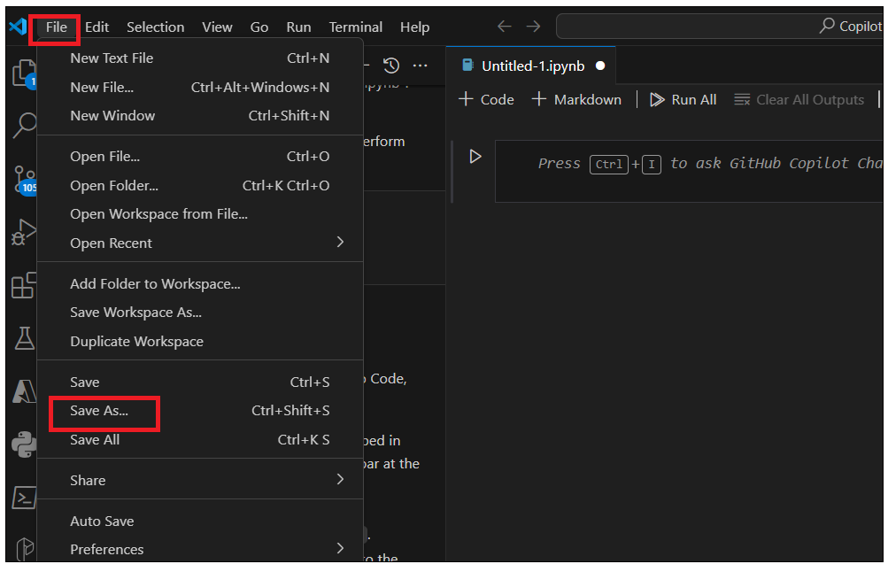

**Lab 05- Create a Notebook using Github Copilot chat and provide
answers based on Test dataINTRODUCTION**

This dataset tested\_worldwide.csv is origin from Kaggle. This dataset,
which has the number of tests conducted over time, is important to help
make sense of daily reported cases and understand how COVID-19 is truly
spreading in each country.

**INSTRUCTIONS**

1.  Open Visual Studio Code from the Windows Start menu and open the
    folder navigating to C:\\Labfiles\\CopilotHackathon

> 

2.  Click on **Yes,I Trust the Author** button.

3.  Click on **Copilot** icon on right side down corner and select
    **Github Copilot Chat.**

4.  Type your prompt !!create a new notebook in a project. Use command
    /newnotebook and name it as "COVID19 Worldwide Testing Data"!!

> 

5.  You can see the Copilot instructions helping you with instructions.
    Follow the steps and create the notebook.

-   Open the command palette by pressing **Ctrl+Shift+P.**

-   Type !!Jupyter: Create New Blank Notebook!! and press Enter.

> 

-   A new notebook will be created. Save it with the name
    !!COVID19WorldwideTesting Data.ipynb!!.You can also ask Copilot how
    to save a new notebook.

> 

-   Go to the destination folder – **excercisefiles-? dataengineer**
    enter the !!COVID19WorldwideTesting Data.ipynb!! and save the file.

> 

6.  You should see the file was created under **dataengineer** folder.

2\. Use Copilot and Copilot Chat to develop the exercise and support
your learning.

**EXERCISE**

Our analysis tries to provide an answer to this question: **Which
countries have reported the highest number of positive cases in relation
to the number of tests conducted?**

**Task 1 : Import Required Libraries**

1.  Click on Notebook kernel and type !!\#*Import Required
    Libraries.Including Pandas!! and* press Enter

2.  Press tab. It will take you to the end of the line. Press Enter and
    again press Tab to add all libraries.

\# Import the necessary libraries, including pandas.

*\# Import Required Libraries*

*\# Here we are importing the necessary libraries for our task*

**import** pandas **as** pd *\# pandas is a software library written for
the Python programming language for data manipulation and analysis.*

# **Task 2 : Load the Dataset**

1.  Use pandas to load the 'tested\_worldwide.csv' file from the root
    level.

2.  Ask Github Copilot to help you on how to load data. Enter !!Use
    pandas to load the 'tested\_worldwide.csv' file from the root
    level!!

3.  Enter the below code in a Notebook and run it.It will ask you to
    select **Python Environment**. Select it.

7.  Select the recommended environment. script runs and provides the
    results.

### Task 3 : Understanding the Data

1.  Use the head() function to display the first 5 rows of the dataset

2.  Ask your Github Copilot to help you with the code to display first 5
    rows of the dataset. !!display first 5 rows of the dataset!!

> 

3.  Click on **+ code** to open new kerner. Just enter \# display first
    5 rows of dataset. It will automatically predict your question. Just
    press tag and then press Enter.

> 

8.  **Coiplot** predicts the command you are looking for, so press the
    tab to accept the code. You always have the option to edit/write
    your own code.

9.  Press the tab and accept the code. Run the kernel.

10. You should see the results.

11. 

9\. Ask your copilot to help with !!Display the number of rows and
columns in the dataframe!!. Click on +code .enter the code and then run
the kernel. You can also use below code

num\_rows, num\_cols **=** data**.**shape

print("Number of rows:", num\_rows)

print("Number of columns:", num\_cols)

10\. Ask your Copilot to help you with this!!**Display the data types of
each column**!! .You can also user !!data.dttypes!!

12. Ask your GitHub Copilot provide code for !!Display the number of
    missing values in each column.!!

13\. Add a new kernel and add the below code and run it. You can also
use the code suggested by Copilot and check

missing\_values **=** df**.**isnull()**.**sum()

print(missing\_values)

13. Run the below code in the new kernel to Display the number of unique
    values in each column. Check with your copilot about code and
    results.

unique\_values **=** df**.**nunique()

print(unique\_values)

**Task 4 : Data Cleaning**

1.  Run the below code to Drop the columns that are not needed for the
    analysis. Ask you copilot for the code and check the results.

> data **=** df\[\['Country\_Region', 'positive', 'total\_tested'\]\]

2.  Type !!\#Rename the columns to make them more readable!! In a new
    kernel and accept the code.

> 

3.  You can use the below code and run it.

df**.**rename(columns**=**{'Country\_Region': 'Country', 'positive':
'Positive Cases', 'total\_tested': 'Total Tested'}, inplace**=True**)

4.  Ask your copilot to !!Drop the rows that have missing values!! And
    run the code in a new kernel or Type !!\#Drop the rows that have
    missing values!! In new kernel press enter. Press the tab and accept
    the code

5.  Add a new +Code kernel and type !!\#Convert the data types of the
    columns to the appropriate types!! , press **tag** to accept the
    code, again enter and press tab. Generate code for Positive cases,
    Total Tested and country, and then run it.

6.  Add a new +Code kernel and type !!\#Display the number of missing
    values in each column!! And press Enter. Press tab and accept the
    code. You can also ask in GitHub Copilot chat

> 
>
> 

**Task 5 : Extracting the Top Ten Countries with Most Covid-19 Cases.**

1.  Ask your Copilot chat to help you with code !!Create a new dataframe
    that contains the total number of positive cases for each country!!
    Or open new code and type !!\#Create a new dataframe that contains
    the total number of positive cases for each country!! and press
    Etner. Press tab to accep the code.

2.  In a new code enter below prompts and enter after each prompt to
    accept the code and run it.

*\# Group the data by 'Country' and calculate the sum of 'Positive
Cases'*

total\_positive\_cases **=** data**.**groupby('Country')\['Positive
Cases'\]**.**sum()

*\# Create a new dataframe with the total positive cases for each
country*

df\_total\_positive\_cases **=** pd**.**DataFrame({'Country':
total\_positive\_cases**.**index, 'Total Positive Cases':
total\_positive\_cases**.**values})

*\# Display the new dataframe*

df\_total\_positive\_cases

3.  Ask Copilot to !!Sort the dataframe in descending order of the total
    number of positive cases!! Or type !!\# Sort the dataframe in
    descending order of the total number of positive cases!! In the new
    Code kernel press tag to accept the code and run it.

4.  Ask your Github Copilot chat to help you with !!Display the top ten
    countries with the most positive cases!! Or type !!\# Display the
    top ten countries with the most positive cases!! In new code kernel
    and runt it. Remember you just need to display.

**Task 6 : Identifying the Highest Positive Against Tested Cases**

1.  Ask your GitHub Copilot Chat to help you with this!!Create a new
    dataframe that contains the total number of tests conducted for each
    country!! or open new Code kernel and type !!\# Create a new
    dataframe that contains the total number of tests conducted for each
    country!! and press tab to accep the code. You can edit the code if
    required and run it.

*\# Group the data by 'Country' and calculate the sum of 'Total Tested'*

total\_tests **=** data**.**groupby('Country')\['Total
Tested'\]**.**sum()

*\# Create a new dataframe with the total tests conducted for each
country*

df\_total\_tests **=** pd**.**DataFrame({'Country':
total\_tests**.**index, 'Total Tests': total\_tests**.**values})

*\# Display the new dataframe*

df\_total\_tests

2.  Ask your Github Copilot Chat !!Sort the dataframe in descending
    order of the total number of tests conducted!! Or open a new code
    kernel ,type !!\# Sort the dataframe in descending order of the
    total number of tests conducted!! And press tab to caccep the code
    and run it.

> 

3.  Ask your Github Copilot Chat !! Display the top ten countries with
    the most tests conducted!! Or open a new code kernel ,type !!\#
    Display the top ten countries with the most tests conducted!! And
    press tab to caccep the code and run it.

> 

**Task 7 : Identifying top three countries that have had the highest
number of positive cases against the number of tests carried out**

1.  Ask your Github Copilot Chat !! Merge the two dataframes created in
    the previous steps!! Or open a new code kernel and type !!\# Display
    the top ten countries with the most tests conducted!! And press tab
    to caccep the code and run it.

2.  Ask your Github Copilot Chat !!Create a new column that contains the
    ratio of positive cases to the number of tests conducted!! Or open a
    new code kernel and type !!\# Create a new column that contains the
    ratio of positive cases to the number of tests conducted!! And press
    tab to accept the code and run it.

> 

3.  Ask your Github Copilot Chat !! Sort the dataframe in descending
    order of the ratio of positive cases to the number of tests
    conducted !! Or open a new code kernel and type !!\# Sort the
    dataframe in descending order of the ratio of positive cases to the
    number of tests conducted!! And press the tab to accept the code and
    run it.

4.  Ask your Github Copilot Chat !! Display the top three countries with
    the highest ratio of positive cases to the number of tests
    conducted!! Or open a new code kernel and type !!\#Display the top
    three countries with the highest ratio of positive cases to the
    number of tests conducted!! And press the tab to accept the code and
    run it

> \#Display the top three countries with the highest ratio of positive
> cases to the number of tests conducted
>
> top\_countries = merged\_df.nlargest(3, 'Positive Test Rate')
>
> top\_countries\[\['Country', 'Positive Test Rate'\]\]

**Task 8 : Displaying the Results**

1.  Ask your Github Copilot Chat to !!Display the results a chart that
    shows the top three countries with the highest ratio of positive
    cases to the number!! Or open a new code kernel and type !!\#
    Display the results a chart that shows the top three countries with
    the highest ratio of positive cases to the number!! And press the
    tab to accept the code and run it

\#Display the results a chart that shows the top three countries with
the highest ratio of positive cases to the number

import matplotlib.pyplot as plt

top\_countries.plot(x='Country', y='Positive Test Rate', kind='bar')

2.  Ask your Github Copilot Chat to !!Display the results in a chart
    that shows the top ten countries with the most positive cases!! Or
    open a new code kernel and type !!\# Display the results in a chart
    that shows the top ten countries with the most positive cases!! And
    press the tab to accept the code and run it

\#Display the results in a chart that shows the top ten countries with
the most positive cases

import matplotlib.pyplot as plt

df\_total\_positive\_cases.head(10).plot(x='Country', y='Total Positive
Cases', kind='bar')

plt.xlabel('Country')

plt.ylabel('Total Positive Cases')

plt.title('Top Ten Countries with the Most Positive Cases')

plt.show()

3\. Ask your Github Copilot Chat to !!Display the results in a chart
that shows the top ten countries with the most tests conducted!! Or open
a new code kernel and type !!\# Display the results in a chart that
shows the top ten countries with the most tests conducted!! And press
the tab to accept the code and run it

**Task 9: Conclusion**

1.  What are your conclusions?

2.  What are the limitations of this analysis?

3.  What are the next steps you would take to improve this analysis?
