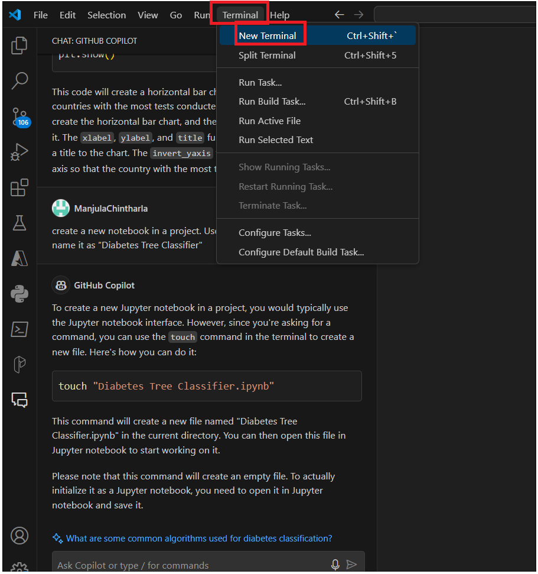
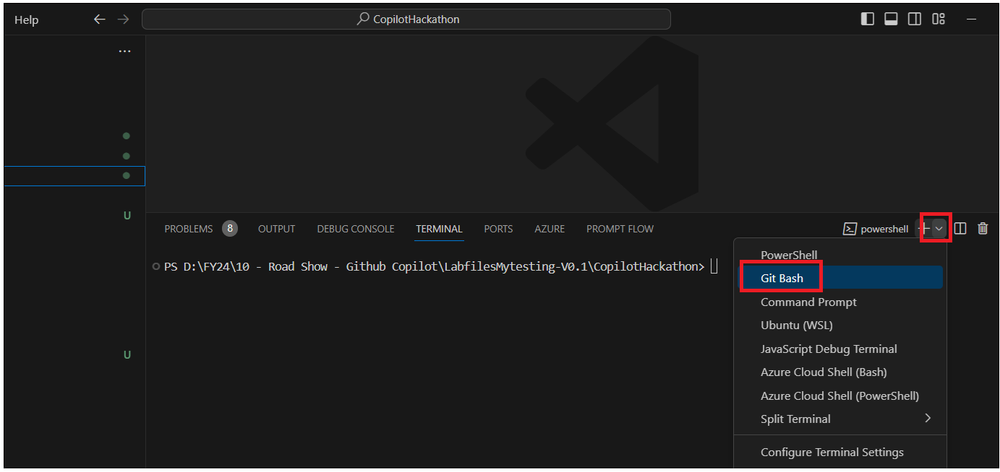
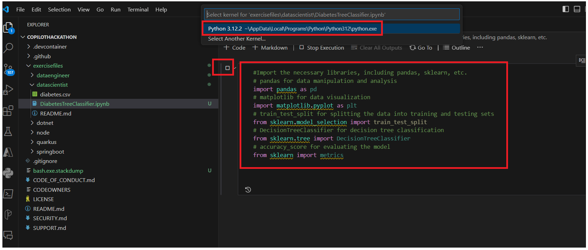

**Lab 06 - Build a decision tree classifier based on Scikit-learn and
Python using Github Copilot Chat**

**INTRODUCTION**

diabetes.csv is originally from the National Institute of Diabetes and
Digestive and Kidney

Diseases. The objective of the dataset is to diagnostically predict
whether a patient has diabetes,

based on certain diagnostic measurements included in the dataset.
Several constraints were placed

on the selection of these instances from a larger database. In
particular, all patients here are females

at least 21 years old of Pima Indian heritage.2

From diabetes.csv you can find several variables, some of them are
independent

(several medical predictor variables) and only one target dependent
variable (Outcome).

**Task 1 : INSTRUCTIONS to Create a notebook using Github Copilot Chat**

1.  From **Explorer in Visual Studio code**, expand **datascientist**.

2.  Click on **Copilot** icon on the right side down corner and select
    **Github Copilot Chat.**

3.  Type your prompt !!create a new notebook in a project. Use command
    /newnotebook and name it as “Diabetes Tree Classifier"!!

> 

4.  Click on **Terminal -&gt; New Terminal** from Toolbar as shown in
    below image.

> 

5.  Select **Gitbash** from the terminal and run the command that
    Copilot suggested in the **datascientist** directory.

!! cd \\exercisefiles\\datascientist\\!!

!!touch "DiabetesTreeClassifier.ipynb"!!

6.  You should see the file was created under **datascientist** folder.

7.  Select the newly created notebook to develop the exercise.

8.  Use Copilot and Copilot Chat to develop the exercise and support
    your learning.

**EXERCISE**

The objective of this project is to build a decision tree classifier
based on Scikit-learn and Python. The classifier should be able to
predict whether a patient has diabetes or not based on

certain diagnostic measurements included in the dataset.

**Task 2 : Importing Required libraries to build a decision tree
classifier**

1.  Click on Notebook kernel and type !!\# Import the necessary
    libraries, including pandas, sklearn, etc.*!! and* press Enter and
    press tab to accept the code

2.  Press tab. It will take you to the end of the line. Press Enter and
    again press Tab to add all libraries.

*!!\# pandas for data manipulation and analysis!!*

*!!\# matplotlib for data visualization!!*

*!!\# train\_test\_split for splitting the data into training and
testing sets!!*

*!!\# DecisionTreeClassifier for decision tree classification!!*

*!!\# accuracy\_score for evaluating the model!!*

3.  Run the code, It will ask you to select Python environment ,select
    it and run

4.  Wait until all libraries get imported.

**Task 3 : Loading the dataset**

1.  Open the **diabetes.csv** file and observe the column names.

2.  Load the diabetes dataset using pandas or from sklearn datasets.
    Open new code kernel and type !!\# Load the diabetes dataset using
    pandas or from sklearn datasets!! And press tab to accept the code

3.  Open Github Copilot chat and ask to !!Load the diabetes dataset
    using pandas or from sklearn datasets.!! .It gives you the code Load
    the diabetes dataset using pandas or from sklearn datasets

4.  Click on +code to open a new kernel copy the code that was suggested
    by Copilot and run. You can also use the below code to load data.

\# Load the Diabetes Dataset

col\_names = \['pregnant', 'glucose', 'bp', 'skin', 'insulin', 'bmi',
'pedigree', 'age', 'label'\]

\# load dataset

diabetes\_df = pd.read\_csv("diabetes.csv", header=None,
names=col\_names)

\# Display the first 5 rows of the DataFrame

diabetes\_df.head()

> 

**Task 4 : Exploratory Data Analysis**

Display the number of rows and columns in the dataframe. Display the
data types of each column. Display the number of missing values in each
column. Display the number of unique values in each column. Display the
basic statistics of each column.

1.  Open a new Code kernel and type !!\#Display the first 5 rows of the
    dataframe!! Press Enter. Press the tab to accept the code. You can
    also use the below code.

> \#Display the first 5 rows of the dataframe
>
> diabetes\_df.head()

2.  Open a new Code kernel and type !!*\#Display the data types of each
    column.*!! Press Enter. Press the tab to accept the code.

> 

3.  Open a new Code kernel and type !!*\#*Display the number of missing
    values in each column!! Press Enter. Press the tab to accept the
    code.

4.  Open a new Code kernel and type !!*\#*Display the number of unique
    values in each column!! Press Enter. Press the tab to accept the
    code.

5.  Open a new Code kernel and type !!*\#Display the summary statistics
    of the dataframe.*!! Press Enter. Press the tab to accept the code.

**Task 5 : Feature Selection**

1.  Select the features that you want to use for the prediction. You can
    use all the features or a subset of features.

2.  Open a new Code kernel and type !!*\#*Split the data into features
    and target variables.!! Press Enter. Press the tab to accept the
    code. You can ask Copilot chat for an explanation. You can also use
    the below code and run it.

*\#split dataset in features and target variable*

feature\_cols = \['pregnant', 'insulin', 'bmi',
'age','glucose','bp','pedigree'\]

X = diabetes\_df\[feature\_cols\] *\# Features*

y = diabetes\_df.label *\# Target variable*

3.  Divide the data into training and testing sets. The training set
    will be used to train the model and the testing set will be used to
    evaluate the model.

4.  Open a new Code kernel and type !!*\#*Split the data into training
    and testing sets!! Press Enter. Press the tab to accept the code.
    You can ask Copilot chat for an explanation. You can also use the
    below code and run it.

*\# Split dataset into training set and test set*

X\_train, X\_test, y\_train, y\_test = train\_test\_split(X, y,
test\_size=0.3, random\_state=1) *\# 70% training and 30% test*

# **Task 6 : Building Decision Tree Model**

1.  Build a decision tree model using the training set.

2.  Open a new Code kernel and type !!*\#*Split the data into training
    and testing sets!! Press Enter. Press the tab to accept the code.
    You can ask Copilot chat for an explanation. You can also use the
    below code and run it.

*\# Building Decision Tree Model*

*\# Create Decision Tree classifer object*

clf = DecisionTreeClassifier()

*\# Train Decision Tree Classifer*

clf = clf.fit(X\_train,y\_train)

*\#Predict the response for test dataset*

y\_pred = clf.predict(X\_test)

3.  You can see ValueError. Ask Github Copilot to fix the issue .Follow
    Copilot chat instruction and fix the issue.

2\. Open a new Code kernel and type !!*\#* Model Accuracy, how often is
the classifier correct?!! Press Enter. Press the tab to accept the code.
You can ask Copilot chat for an explanation. You can also use the below
code and run it.

\# Evaluating Model

\# Model Accuracy, how often is the classifier correct?

print("Accuracy:",metrics.accuracy\_score(y\_test, y\_pred))

4.  Evaluate the model using the testing set.

> *\# Evaluating Model*
>
> *\# Model Accuracy, how often is the classifier correct?*
>
> print("Accuracy:",metrics.accuracy\_score(y\_test, y\_pred))
