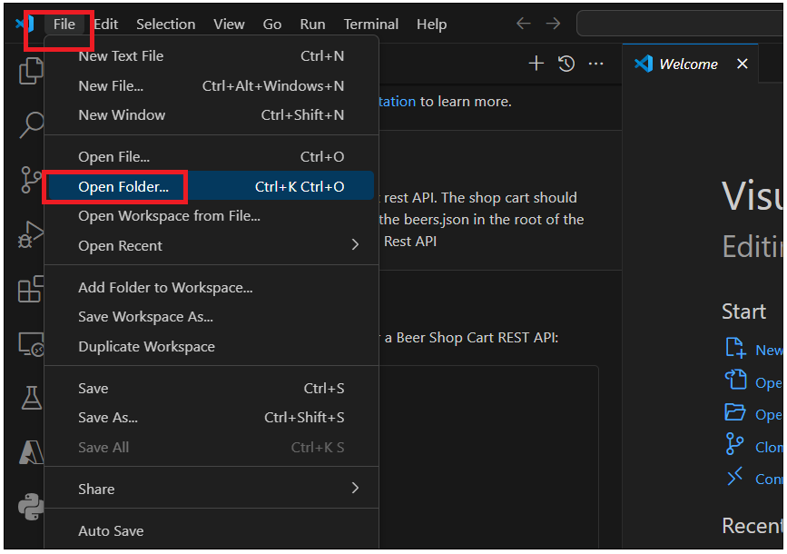

**Lab 07 - Develop a shop cart using a Github Copilot**

The goal of this lab is to develop a shop cart. The shop cart should
allow users to add and remove products.

This lab is to show how to use GitHub Copilot to help you write a new
Java Spring Boot REST API application. These are suggested prompts to
use with GitHub Copilot. Feel free to modify them or add additional
prompts to get the desired results.

**Practical Copilot Techniques for Visual Studio Code**

-   Open a source file, write a comment description of what you want,
    type &lt;ENTER&gt;, and a suggestion should appear on the following
    line.

    -   If you like the suggestion, hit &lt;TAB&gt; on the keyboard to
        accept.

    -   If the suggestion is unacceptable and you want to type something
        else, type &lt;ESC&gt; on the keyboard to decline the
        suggestion. Then, you may continue typing.

    -   If no suggestion appears, or the suggestion disappears, and you
        want it back, then hit &lt;ALT&gt; + \\ on the keyboard; if
        there is a suggestion, it will appear.

    -   When there are multiple suggestions, to view them,
        type &lt;ALT&gt; + \] or &lt;ALT&gt; + \[ to cycle left and
        right through them. Also, you can hover over the suggestion with
        your mouse cursor to see more.

    -   To view multiple suggestions in a new editor tab,
        type &lt;CTRL&gt; + &lt;ENTER&gt; to open a new tab and review
        the generated suggestions.

**Useful Copilot Chat Techniques for Visual Studio Code**

-   To open a chat session to discuss a code snippet, highlight the code
    in the editor and type &lt;CTRL&gt;+i on Windows and Linux
    and &lt;CMD&gt;+i on macOS.

-   If you do not understand some lines of code, highlight them,
    right-click, and select Copilot → Explain This from the context
    menu.

-   If you want to fix some lines of code, highlight them, right-click,
    and choose Copilot → Fix This from the context menu.

-   To get help within Copilot Chat, open the chat panel, type in /help,
    and then hit &lt;ENTER&gt;. A good summary of available Copilot Chat
    commands will appear.

-   @&lt;some scope&gt; handles your prompts within a scope; there are
    three scopes: @workspace, @vscode, and @terminal

    -   @workspace is for creating new projects and managing existing
        projects.

    -   @vscode is for editor configuration and managing extensions.

    -   @terminal is for running commands in the terminal.

Copilot does not have access to the file system except for creating a
new project with the @workspace /new command. Copilot does not have
access to your entire solution or other code repositories when making
suggestions via Copilot.

**INSTRUCTIONS**

**1. Choose a programming language of your choice.**

**2. The topic selected is beer. You can use the JSON beers.json in the
root of the project to get the list of beers for building the Rest
API.**

**3. Develop the shop cart. You can use the following steps as a
guide:**

\- Create an API Rest with methods to:

> -get the beers list with page offset and limit.
>
> \- get beer details by id.
>
> \- Search beers by name, description, tagline, food\_pairing, price.

\- Create a list of products in the main page.

\- Create a search bar to filter the products.

\- Navigate to the description page when the user clicks on a product.

\- (Optional) Slicer to filter the products by price.

\- Create a shop cart.

> Add a product to the shop cart.
>
> Remove a product from the shop cart.
>
> Calculate the total price of the products in the shop cart.

**Start asking the copilot as a beginner in coding and development to
help to build the Rest API.**

**4. Develop the shop cart.**

1\. Launch Visual Studio Code from your VM.

2\. To open a chat session to discuss a code snippet, highlight the code
in the editor and type **&lt;CTRL&gt;+i** on Windows

3\. Copilot Chat Prompt : !! I am new to development with no coding
skills.need your help develop a beer shop cart rest api using javascript
with beers.json in root of the project. The beer shop cart should allow
users to add and remove products.! !

You can write your prompt as per your requirement

4\. Copilot Chat Responses with step-by-step plan

5\. Ask Copilot , how to create a project structure.

!! how to create a project structure to create beer shop cart Rest API!!

6\. Click on Terminal -&gt; New Terminal.

7\. Follow the steps suggested by Copilot to create a folder structure.

-   Create a new directory for your project. You can name
    it beer-shop-api. You can do this by running the command !!mkdir
    beer-shop-api!! in your terminal.

-   Navigate into the new directory using the command !!cd
    beer-shop-api!!.

-   Initialize a new Node.js project by running !!npm init -y!!. This
    will create a package.json file in your project directory.

> 

-   Install the necessary dependencies for your project. For this
    project, you'll need express and body-parser. Install them by
    running !!npm install express body-parser!!

> 

-   Create a new file named server.js. This will be the main file for
    your application. !! New-Item -Path . -Name "server.js" -ItemType
    "file"!!

-   Create a new file named beers.json in the root of your project. This
    file will contain the list of beers.Run !!New-Item -Path . -Name
    "beers.json" -ItemType "file"!!

> 

7\. Click on **File -&gt; Open Folder.**

7\. Navigate to the location where you created your workspace and open
the folder in Visual Studio.

8\. trust authors.

8\. Click on the **beers.json** and copy the below code into it.

**Note : You can also find this file in C:\\Labfiles**

\[

{

"id": 1,

"name": "Buzz",

"tagline": "A Real Bitter Experience.",

"first\_brewed": "09/2007",

"description": "A light, crisp and bitter IPA brewed with English and
American hops. A small batch brewed only once.",

"image\_url": "https://images.punkapi.com/v2/keg.png",

"price": 2.5,

"abv": 4.5,

"ibu": 60,

"target\_fg": 1010,

"target\_og": 1044,

"ebc": 20,

"srm": 10,

"ph": 4.4,

"attenuation\_level": 75,

"volume": {

"value": 20,

"unit": "litres"

},

"boil\_volume": {

"value": 25,

"unit": "litres"

},

"food\_pairing": \[

"Spicy chicken tikka masala",

"Grilled chicken quesadilla",

"Caramel toffee cake"

\],

"brewers\_tips": "The earthy and floral aromas from the hops can be
overpowering. Drop a little Cascade in at the end of the boil to lift
the profile with a bit of citrus.",

"contributed\_by": "Sam Mason &lt;samjbmason&gt;"

},

{

"id": 2,

"name": "Trashy Blonde",

"tagline": "You Know You Shouldn't",

"first\_brewed": "04/2008",

"description": "A titillating, neurotic, peroxide punk of a Pale Ale.
Combining attitude, style, substance, and a little bit of low self
esteem for good measure; what would your mother say? The seductive lure
of the sassy passion fruit hop proves too much to resist. All that is
even before we get onto the fact that there are no additives,
preservatives, pasteurization or strings attached. All wrapped up with
the customary BrewDog bite and imaginative twist.",

"image\_url": "https://images.punkapi.com/v2/2.png",

"price": 1.30,

"abv": 4.1,

"ibu": 41.5,

"target\_fg": 1010,

"target\_og": 1041.7,

"ebc": 15,

"srm": 15,

"ph": 4.4,

"attenuation\_level": 76,

"volume": {

"value": 20,

"unit": "litres"

},

"boil\_volume": {

"value": 25,

"unit": "litres"

},

"food\_pairing": \[

"Fresh crab with lemon",

"Garlic butter dipping sauce",

"Goats cheese salad",

"Creamy lemon bar doused in powdered sugar"

\],

"brewers\_tips": "Be careful not to collect too much wort from the mash.
Once the sugars are all washed out there are some very unpleasant grainy
tasting compounds that can be extracted into the wort.",

"contributed\_by": "Sam Mason &lt;samjbmason&gt;"

},

{

"id": 3,

"name": "Berliner Weisse With Yuzu - B-Sides",

"tagline": "Japanese Citrus Berliner Weisse.",

"first\_brewed": "11/2015",

"description": "Japanese citrus fruit intensifies the sour nature of
this German classic.",

"image\_url": "https://images.punkapi.com/v2/keg.png",

"price": 2.5,

"abv": 4.2,

"ibu": 8,

"target\_fg": 1007,

"target\_og": 1040,

"ebc": 8,

"srm": 4,

"ph": 3.2,

"attenuation\_level": 83,

"volume": {

"value": 20,

"unit": "litres"

},

"boil\_volume": {

"value": 25,

"unit": "litres"

},

"food\_pairing": \[

"Smoked chicken wings",

"Miso ramen",

"Yuzu cheesecake"

\],

"brewers\_tips": "Clean everything twice. All you want is the clean
sourness of lactobacillus.",

"contributed\_by": "Sam Mason &lt;samjbmason&gt;"

},

{

"id": 4,

"name": "Pilsen Lager",

"tagline": "Unleash the Yeast Series.",

"first\_brewed": "09/2013",

"description": "Our Unleash the Yeast series was an epic experiment into
the differences in aroma and flavour provided by switching up your
yeast. We brewed up a wort with a light caramel note and some toasty
biscuit flavour, and hopped it with Amarillo and Centennial for a
citrusy bitterness. Everything else is down to the yeast. Pilsner yeast
ferments with no fruity esters or spicy phenols, although it can add a
hint of butterscotch.",

"image\_url": "https://images.punkapi.com/v2/4.png",

"price": 1.15,

"abv": 6.3,

"ibu": 55,

"target\_fg": 1012,

"target\_og": 1060,

"ebc": 30,

"srm": 15,

"ph": 4.4,

"attenuation\_level": 80,

"volume": {

"value": 20,

"unit": "litres"

},

"boil\_volume": {

"value": 25,

"unit": "litres"

},

"food\_pairing": \[

"Spicy crab cakes",

"Spicy cucumber and carrot Thai salad",

"Sweet filled dumplings"

\],

"brewers\_tips": "Play around with the fermentation temperature to get
the best flavour profile from the individual yeasts.",

"contributed\_by": "Ali Skinner &lt;AliSkinner&gt;"

},

{

"id": 5,

"name": "Avery Brown Dredge",

"tagline": "Bloggers' Imperial Pilsner.",

"first\_brewed": "02/2011",

"description": "An Imperial Pilsner in collaboration with beer writers.
Tradition. Homage. Revolution. We wanted to showcase the awesome
backbone of the Czech brewing tradition, the noble Saaz hop, and also
tip our hats to the modern beers that rock our world, and the people who
make them.",

"image\_url": "https://images.punkapi.com/v2/5.png",

"price": 4.5,

"abv": 7.2,

"ibu": 59,

"target\_fg": 1027,

"target\_og": 1069,

"ebc": 10,

"srm": 5,

"ph": 4.4,

"attenuation\_level": 67,

"volume": {

"value": 20,

"unit": "litres"

},

"boil\_volume": {

"value": 25,

"unit": "litres"

},

"food\_pairing": \[

"Vietnamese squid salad",

"Chargrilled corn on the cob with paprika butter",

"Strawberry and rhubarb pie"

\],

"brewers\_tips": "Make sure you have a big enough yeast starter to
ferment through the OG and lager successfully.",

"contributed\_by": "Sam Mason &lt;samjbmason&gt;"

},

{

"id": 6,

"name": "Electric India",

"tagline": "Vibrant Hoppy Saison.",

"first\_brewed": "05/2013",

"description": "Re-brewed as a spring seasonal, this beer – which
appeared originally as an Equity Punk shareholder creation – retains its
trademark spicy, fruity edge. A perfect blend of Belgian Saison and US
IPA, crushed peppercorns and heather honey are also added to produce a
genuinely unique beer.",

"image\_url": "https://images.punkapi.com/v2/6.png",

"price": 6.2,

"abv": 5.2,

"ibu": 38,

"target\_fg": 1005,

"target\_og": 1045,

"ebc": 15,

"srm": 7.5,

"ph": 4.4,

"attenuation\_level": 88.9,

"volume": {

"value": 20,

"unit": "litres"

},

"boil\_volume": {

"value": 25,

"unit": "litres"

},

"food\_pairing": \[

"Mussels with a garlic and herb sauce",

"Crab melt sandwich",

"Shortbread cookies"

\],

"brewers\_tips": "Source some really good heather honey to get the right
spicy esters in the beer.",

"contributed\_by": "Sam Mason &lt;samjbmason&gt;"

},

{

"id": 7,

"name": "AB:12",

"tagline": "Imperial Black Belgian Ale.",

"first\_brewed": "07/2012",

"description": "An Imperial Black Belgian Ale aged in old Invergordon
Scotch whisky barrels with mountains of raspberries, tayberries and
blackberries in each cask. Decadent but light and dry, this beer would
make a fantastic base for ageing on pretty much any dark fruit - we used
raspberries, tayberries and blackberries beause they were local.",

"image\_url": "https://images.punkapi.com/v2/7.png",

"price": 2,

"abv": 11.2,

"ibu": 35,

"target\_fg": 1017,

"target\_og": 1108,

"ebc": 80,

"srm": 40,

"ph": 5.3,

"attenuation\_level": 84,

"volume": {

"value": 20,

"unit": "litres"

},

"boil\_volume": {

"value": 25,

"unit": "litres"

},

"food\_pairing": \[

"Tandoori lamb with pomegranate",

"Beef Wellington with a red wine jus",

"Raspberry chocolate torte"

\],

"brewers\_tips": "Don't worry too much about controlling the temperature
with the Belgian yeast strain - just make sure it doesn't rise above
30°C!",

"contributed\_by": "Sam Mason &lt;samjbmason&gt;"

},

{

"id": 8,

"name": "Fake Lager",

"tagline": "Bohemian Pilsner.",

"first\_brewed": "03/2013",

"description": "Fake is the new black. Fake is where it is at. Fake Art,
fake brands, fake breasts, and fake lager. We want to play our part in
the ugly fallout from the Lager Dream. Say hello to Fake Lager – a
zesty, floral 21st century faux masterpiece with added BrewDog
bitterness.",

"image\_url": "https://images.punkapi.com/v2/8.png",

"price": 3.75,

"abv": 4.7,

"ibu": 40,

"target\_fg": 1010,

"target\_og": 1046,

"ebc": 12,

"srm": 6,

"ph": 4.4,

"attenuation\_level": 78,

"volume": {

"value": 20,

"unit": "litres"

},

"boil\_volume": {

"value": 25,

"unit": "litres"

},

"food\_pairing": \[

"Fried crab cakes with avocado salsa",

"Spicy shredded pork roll with hot dipping sauce",

"Key lime pie"

\],

"brewers\_tips": "Once the primary fermentation is complete get this
beer as cold as you can and let it mature for as long as you've got.",

"contributed\_by": "Sam Mason &lt;samjbmason&gt;"

},

{

"id": 9,

"name": "AB:07",

"tagline": "Whisky Cask-Aged Scotch Ale.",

"first\_brewed": "03/2010",

"description": "Whisky cask-aged imperial scotch ale. Beer perfect for
when the rain is coming sideways. Liquorice, plum and raisin temper the
warming alcohol, producing a beer capable of holding back the Scottish
chill.",

"image\_url": "https://images.punkapi.com/v2/9.png",

"price": 4.50,

"abv": 12.5,

"ibu": 30,

"target\_fg": 1020,

"target\_og": 1106,

"ebc": 84,

"srm": 42,

"ph": 5.6,

"attenuation\_level": 83,

"volume": {

"value": 20,

"unit": "litres"

},

"boil\_volume": {

"value": 25,

"unit": "litres"

},

"food\_pairing": \[

"Kedgeree",

"Scotch broth with sourdough bread",

"Clootie dumpling"

\],

"brewers\_tips": "Authentic heather honey adds a beautiful floral top
note that is unachievable any other way.",

"contributed\_by": "Sam Mason &lt;samjbmason&gt;"

},

{

"id": 10,

"name": "Bramling X",

"tagline": "Single Hop IPA Series - 2011.",

"first\_brewed": "01/2011",

"description": "Good old Bramling Cross is elegant, refined, assured,
(boring) and understated. Understated that is unless you hop the living
daylights out of a beer with it. This is Bramling Cross re-invented and
re-imagined, and shows just what can be done with English hops if you
use enough of them. Poor Bramling Cross normally gets lost in a woeful
stream of conformist brown ales made by sleepy cask ale brewers. But not
anymore. This beer shows that British hops do have some soul, and is a
fruity riot of blackberries, pears, and plums. Reminds me of the
bramble, apple and ginger jam my grandmother used to make.",

"image\_url": "https://images.punkapi.com/v2/10.png",

"price": 2,

"abv": 7.5,

"ibu": 75,

"target\_fg": 1013,

"target\_og": 1068,

"ebc": 22,

"srm": 11,

"ph": 4.4,

"attenuation\_level": 80.9,

"volume": {

"value": 20,

"unit": "litres"

},

"boil\_volume": {

"value": 25,

"unit": "litres"

},

"food\_pairing": \[

"Warm blackberry pie",

"Vinegar doused fish and chips",

"Aromatic korma curry with lemon and garlic naan"

\],

"brewers\_tips": "Getting good Bramling Cross is key. Most English hops
are in leaf form (not pelletised), so getting fresh hops close to
harvest (September) will give this beer the right amount of dark berry
intensity.",

"contributed\_by": "Sam Mason &lt;samjbmason&gt;"

},

{

"id": 11,

"name": "Misspent Youth",

"tagline": "Milk & Honey Scotch Ale.",

"first\_brewed": "04/2013",

"description": "The brainchild of our small batch brewer, George Woods.
A dangerously drinkable milk sugar- infused Scotch Ale.",

"image\_url": "https://images.punkapi.com/v2/keg.png",

"price": 10,

"abv": 7.3,

"ibu": 30,

"target\_fg": 1020,

"target\_og": 1079,

"ebc": 120,

"srm": 60,

"ph": 4.4,

"attenuation\_level": 74.7,

"volume": {

"value": 20,

"unit": "litres"

},

"boil\_volume": {

"value": 25,

"unit": "litres"

},

"food\_pairing": \[

"Roasted garlic and chilli infused camembert cheese",

"Korean style chicken wings",

"Chocolate milk shake"

\],

"brewers\_tips": "Lots of malt in this one. Mash-in in stages, and
spread the pale ale malt throughout the mash to provide stability. If
the mash starts to sink, stop, wait a few minutes while mixing, then
start again.",

"contributed\_by": "Sam Mason &lt;samjbmason&gt;"

},

{

"id": 12,

"name": "Arcade Nation",

"tagline": "Seasonal Black IPA.",

"first\_brewed": "12/2015",

"description": "Running the knife-edge between an India Pale Ale and a
Stout, this particular style is one we truly love. Black IPAs are a
great showcase for the skill of our brew team, balancing so many complex
and twisting flavours in the same moment. The citrus, mango and pine
from the hops – three of our all-time favourites – play off against the
roasty dryness from the malt bill at each and every turn.",

"image\_url": "https://images.punkapi.com/v2/12.png",

"price": 1.75,

"abv": 5.3,

"ibu": 60,

"target\_fg": 1012,

"target\_og": 1052,

"ebc": 200,

"srm": 100,

"ph": 4.2,

"attenuation\_level": 77,

"volume": {

"value": 20,

"unit": "litres"

},

"boil\_volume": {

"value": 25,

"unit": "litres"

},

"food\_pairing": \[

"King prawn kebabs",

"Halibut with a mango and tomato salad",

"Mint chocloate ice cream"

\],

"brewers\_tips": "Be as accurate as possible when weighing out your
malts to ensure you strike the right balance.",

"contributed\_by": "Sam Mason &lt;samjbmason&gt;"

},

{

"id": 13,

"name": "Movember",

"tagline": "Moustache-Worthy Beer.",

"first\_brewed": "11/2009",

"description": "A deliciously robust, black malted beer with a decadent
dark, dry cocoa flavour that provides an enticing backdrop to the
Cascade hops.",

"image\_url": "https://images.punkapi.com/v2/13.png",

"price": 2.85,

"abv": 4.5,

"ibu": 50,

"target\_fg": 1012,

"target\_og": 1047,

"ebc": 140,

"srm": 70,

"ph": 5.2,

"attenuation\_level": 74.5,

"volume": {

"value": 20,

"unit": "litres"

},

"boil\_volume": {

"value": 25,

"unit": "litres"

},

"food\_pairing": \[

"Vegetable egg scramble",

"Margherita pizza",

"Fresh berry crisp tart"

\],

"brewers\_tips": "If you can’t find really fresh cascade, substitute it
for Amarillo or Ahtanum.",

"contributed\_by": "Sam Mason &lt;samjbmason&gt;"

},

{

"id": 14,

"name": "Alpha Dog",

"tagline": "Existential Red Ale.",

"first\_brewed": "02/2010",

"description": "A fusion of caramel malt flavours and punchy New Zealand
hops. A session beer you can get your teeth into.",

"image\_url": "https://images.punkapi.com/v2/14.png",

"price": 3.75,

"abv": 4.5,

"ibu": 42,

"target\_fg": 1025,

"target\_og": 1046,

"ebc": 62,

"srm": 31,

"ph": 4.4,

"attenuation\_level": 72.8,

"volume": {

"value": 20,

"unit": "litres"

},

"boil\_volume": {

"value": 25,

"unit": "litres"

},

"food\_pairing": \[

"Pastrami",

"Swiss and horseradish sandwich",

"Sharp cheddar cheese and onion/ raisin chutney",

"Peanut brittle"

\],

"brewers\_tips": "Crush the malt as close to brewing time as possible.
The fresher the malt, the more intense caramel flavours will be released
in the wort.",

"contributed\_by": "Sam Mason &lt;samjbmason&gt;"

},

{

"id": 15,

"name": "Mixtape 8",

"tagline": "An Epic Fusion Of Old Belgian, American New Wave, And Scotch
Whisky.",

"first\_brewed": "01/2012",

"description": "This recipe is for the Belgian Tripel base. A blend of
two huge oak aged beers – half a hopped up Belgian Tripel, and half a
Triple India Pale Ale. Both aged in single grain whisky barrels for two
years and blended, each beer brings its own character to the mix. The
Belgian Tripel comes loaded with complex spicy, fruity esters, and
punchy citrus hop character.",

"image\_url": "https://images.punkapi.com/v2/15.png",

"price": 5.50,

"abv": 14.5,

"ibu": 50,

"target\_fg": 1014,

"target\_og": 1093,

"ebc": 40,

"srm": 20,

"ph": 4.4,

"attenuation\_level": 85,

"volume": {

"value": 20,

"unit": "litres"

},

"boil\_volume": {

"value": 25,

"unit": "litres"

},

"food\_pairing": \[

"Coriander & chilli crab cakes",

"Goats cheese salad with walnuts, radish and blood orange",

"Pistachio cake"

\],

"brewers\_tips": "Brew twice as much Belgian Tripel as you were planning
on ageing - it's awesome on its own too!",

"contributed\_by": "Sam Mason &lt;samjbmason&gt;"

},

{

"id": 16,

"name": "Libertine Porter",

"tagline": "Dry-Hopped Aggressive Porter.",

"first\_brewed": "01/2012",

"description": "An avalanche of cross-continental hop varieties give
this porter a complex spicy, resinous and citrusy aroma, with a huge
malt bill providing a complex roasty counterpoint. Digging deeper into
the flavour draws out cinder toffee, bitter chocolate and hints of
woodsmoke.",

"image\_url": "https://images.punkapi.com/v2/16.png",

"price": 6.50,

"abv": 6.1,

"ibu": 45,

"target\_fg": 1020,

"target\_og": 1067,

"ebc": 219,

"srm": 109.5,

"ph": 4.4,

"attenuation\_level": 70.1,

"volume": {

"value": 20,

"unit": "litres"

},

"boil\_volume": {

"value": 25,

"unit": "litres"

},

"food\_pairing": \[

"Blue cheese beef burger",

"Glazed short ribs",

"Chocolate cake"

\],

"brewers\_tips": "Mash in at a higher temperature to leave more
unfermentable sugars in the wort. This gives the beer a sweeter porter
profile.",

"contributed\_by": "Sam Mason &lt;samjbmason&gt;"

},

{

"id": 17,

"name": "AB:06",

"tagline": "Imperial Black IPA.",

"first\_brewed": "04/2011",

"description": "Our sixth Abstrakt, this imperial black IPA combined
dark malts with a monumental triple dry-hop, using an all-star team of
some of our favourite American hops. Roasty and resinous.",

"image\_url": "https://images.punkapi.com/v2/17.png",

"price": 3.50,

"abv": 11.2,

"ibu": 150,

"target\_fg": 1013,

"target\_og": 1098,

"ebc": 70,

"srm": 35,

"ph": null,

"attenuation\_level": 87,

"volume": {

"value": 20,

"unit": "litres"

},

"boil\_volume": {

"value": 25,

"unit": "litres"

},

"food\_pairing": \[

"Coffee dusted venison loin",

"Memphis-style beef short ribs",

"Chocolate orange brownies"

\],

"brewers\_tips": "Boil down to desired OG (about 17 litres).",

"contributed\_by": "Sam Mason &lt;samjbmason&gt;"

},

{

"id": 18,

"name": "Russian Doll – India Pale Ale",

"tagline": "Nesting Hop Bomb.",

"first\_brewed": "08/2014",

"description": "The levels of hops vary throughout the range. We love
hops, so all four beers are big, bitter badasses, but by tweaking the
amount of each hop used later in the boil and during dry- hopping, we
can balance the malty backbone with some unexpected flavours. Simcoe is
used in the whirlpool for all four beers, and yet still lends different
characters to each",

"image\_url": "https://images.punkapi.com/v2/18.png",

"price": 2.5,

"abv": 6,

"ibu": 70,

"target\_fg": 1012,

"target\_og": 1058,

"ebc": 25,

"srm": 12.5,

"ph": 5.2,

"attenuation\_level": 79.3,

"volume": {

"value": 20,

"unit": "litres"

},

"boil\_volume": {

"value": 25,

"unit": "litres"

},

"food\_pairing": \[

"Spicy chicken skewers",

"Fish tacos with hot sauce",

"Lemon pound cake with a ice sugar glaze"

\],

"brewers\_tips": "Create balance through experimentation with the hop
amounts and malt backbone.",

"contributed\_by": "Sam Mason &lt;samjbmason&gt;"

},

{

"id": 19,

"name": "Hello My Name Is Mette-Marit",

"tagline": "Lingonberry Double IPA.",

"first\_brewed": "06/2013",

"description": "We sent this beer to Norway where it was known as
'Hello, my name is Censored’. You can make up your own mind as to why.
This brew was a red berry explosion, with a reisnous bitter edge layered
with dry berry tartness.",

"image\_url": "https://images.punkapi.com/v2/19.png",

"price": 0.99,

"abv": 8.2,

"ibu": 70,

"target\_fg": 1013,

"target\_og": 1076,

"ebc": null,

"srm": null,

"ph": 4.4,

"attenuation\_level": 83,

"volume": {

"value": 20,

"unit": "litres"

},

"boil\_volume": {

"value": 25,

"unit": "litres"

},

"food\_pairing": \[

"Fårikål (mutton stew) with a spicy twist",

"Fenalår (salted cured lamb)",

"Krumkake with lingonberry jam"

\],

"brewers\_tips": "Using crushed cranberries will dry out the beer
further, drawing out their natural astringent character.",

"contributed\_by": "Sam Mason &lt;samjbmason&gt;"

},

{

"id": 20,

"name": "Rabiator",

"tagline": "Imperial Wheat Beer",

"first\_brewed": "03/2011",

"description": "Imperial Wheat beer / Weizenbock brewed by a homesick
German in leather trousers. Think banana bread, bubble gum and David
Hasselhoff.",

"image\_url": "https://images.punkapi.com/v2/keg.png",

"price": 3.15,

"abv": 10.27,

"ibu": 26,

"target\_fg": 1014,

"target\_og": 1092,

"ebc": 24,

"srm": 12,

"ph": 4.4,

"attenuation\_level": 85,

"volume": {

"value": 20,

"unit": "litres"

},

"boil\_volume": {

"value": 25,

"unit": "litres"

},

"food\_pairing": \[

"Grilled portabello mushroom burger",

"Chicken sausages with creamy mash",

"Caramel and banana meringue pie"

\],

"brewers\_tips": "If you are struggling to get that authentic head
retention increase your mash temperature to about 70°C.",

"contributed\_by": "Sam Mason &lt;samjbmason&gt;"

},

{

"id": 21,

"name": "Vice Bier",

"tagline": "Hoppy Wheat Bier.",

"first\_brewed": "04/2013",

"description": "Our take on the classic German Kristallweizen. A clear
German wheat beer, layers of bubblegum and vanilla perfectly balanced
with the American and New Zealand hops.",

"image\_url": "https://images.punkapi.com/v2/keg.png",

"price": 4.50,

"abv": 4.3,

"ibu": 25,

"target\_fg": 1010,

"target\_og": 1043,

"ebc": 30,

"srm": 15,

"ph": 4,

"attenuation\_level": 81.8,

"volume": {

"value": 20,

"unit": "litres"

},

"boil\_volume": {

"value": 25,

"unit": "litres"

},

"food\_pairing": \[

"Citrus salad with balsamic dressing",

"Lobster",

"Ginger and orange cookies"

\],

"brewers\_tips": "Ferment at higher or lower temperatures to select the
esters that will create clove- like or banana-like flavours.",

"contributed\_by": "Sam Mason &lt;samjbmason&gt;"

},

{

"id": 22,

"name": "Devine Rebel (w/ Mikkeller)",

"tagline": "Oak-aged Barley Wine.",

"first\_brewed": "12/2008",

"description": "Two of Europe's most experimental, boundary-pushing
brewers, BrewDog and Mikkeller, combined forces to produce a rebellious
beer that combined their respective talents and brewing skills. The
12.5% Barley Wine fermented well, and the champagne yeast drew it ever
closer to 12.5%. The beer was brewed with a single hop variety and was
going to be partially aged in oak casks.",

"image\_url": "https://images.punkapi.com/v2/22.png",

"price": 4.5,

"abv": 12.5,

"ibu": 100,

"target\_fg": 1030,

"target\_og": 1093,

"ebc": 36,

"srm": 18,

"ph": 4.4,

"attenuation\_level": 68,

"volume": {

"value": 20,

"unit": "litres"

},

"boil\_volume": {

"value": 25,

"unit": "litres"

},

"food\_pairing": \[

"Stilton on gingerbread biscuits",

"Pot roasted artichokes",

"Lamb chops with caramelised figs"

\],

"brewers\_tips": "Rack off to a secondary fermenter before pitching in
some champagne.",

"contributed\_by": "Sam Mason &lt;samjbmason&gt;"

},

{

"id": 23,

"name": "Storm",

"tagline": "Islay Whisky Aged IPA.",

"first\_brewed": "12/2007",

"description": "Dark and powerful Islay magic infuses this tropical
sensation of an IPA. Using the original Punk IPA as a base, we boosted
the ABV to 8% giving it some extra backbone to stand up to the peated
smoke imported directly from Islay.",

"image\_url": "https://images.punkapi.com/v2/23.png",

"price": 6.50,

"abv": 8,

"ibu": 60,

"target\_fg": 1010,

"target\_og": 1082,

"ebc": 12,

"srm": 6,

"ph": 4.4,

"attenuation\_level": 86,

"volume": {

"value": 20,

"unit": "litres"

},

"boil\_volume": {

"value": 25,

"unit": "litres"

},

"food\_pairing": \[

"Oysters",

"Hickory smoked ham",

"Rocky Road"

\],

"brewers\_tips": "After primary fermentation is complete, rack off into
a secondary fermeter and add the oak chips to replicate the authentic
Islay barrel experience.",

"contributed\_by": "Sam Mason &lt;samjbmason&gt;"

},

{

"id": 24,

"name": "The End Of History",

"tagline": "The World's Strongest Beer.",

"first\_brewed": "06/2011",

"description": "The End of History: The name derives from the famous
work of philosopher Francis Fukuyama, this is to beer what democracy is
to history. Complexity defined. Floral, grapefruit, caramel and cloves
are intensified by boozy heat.",

"image\_url": "https://images.punkapi.com/v2/24.png",

"price": 8.75,

"abv": 55,

"ibu": null,

"target\_fg": 1000,

"target\_og": 1112,

"ebc": null,

"srm": null,

"ph": 4.4,

"attenuation\_level": 100,

"volume": {

"value": 20,

"unit": "litres"

},

"boil\_volume": {

"value": 25,

"unit": "litres"

},

"food\_pairing": \[

"Roasted wood pigeon with black pudding",

"Pan seared venison fillet with juniper sauce",

"Apricot coconut cake"

\],

"brewers\_tips": "You'll have to get this one all the way down to -70°C.
Taxidermy is not optional.",

"contributed\_by": "Sam Mason &lt;samjbmason&gt;"

},

{

"id": 25,

"name": "Bad Pixie",

"tagline": "Spiced Wheat Beer.",

"first\_brewed": "10/2008",

"description": "2008 Prototype beer, a 4.7% wheat ale with crushed
juniper berries and citrus peel.",

"image\_url": "https://images.punkapi.com/v2/25.png",

"price": 3.75,

"abv": 4.7,

"ibu": 45,

"target\_fg": 1010,

"target\_og": 1047,

"ebc": 8,

"srm": 4,

"ph": 4.4,

"attenuation\_level": 79,

"volume": {

"value": 20,

"unit": "litres"

},

"boil\_volume": {

"value": 25,

"unit": "litres"

},

"food\_pairing": \[

"Poached sole fillet with capers",

"Summer fruit salad",

"Banana split"

\],

"brewers\_tips": "Make sure you have plenty of room in the fermenter.
Beers containing wheat can often foam aggressively during
fermentation.",

"contributed\_by": "Sam Mason &lt;samjbmason&gt;"

}

\]

9\. To open a chat session to discuss a code snippet, highlight the code
in the editor and type **&lt;CTRL&gt;+i** on Windows

9\. iterations of the same prompt adding additional detail to the new
project request to explore how far GitHub Copilot can go to create a
great start to a new project

Copilot Chat Prompt : !! @workspace develop a beer shop cart rest API.
The shop cart should allow users to add and remove products. Use the
beers.json in the root of the project to get the list of beers for
building the Rest API.!

10\. Open **server.js** file and add the suggested code into it.

12\. Now, we have the project structure. Lets start coding with the help
of Copilot.

Copilot Chat Prompt

!!@workspace create get the beers list with page offset and limit
method!!

14\. Open server.js file and add the comment below to get beer details
and type Enter. Press tab to accept the generated code.

!!//get beer details by id.!!

15\. Open server.js file and add the comment below to get beer details
and type Enter. Press tab to accept the generated code.

!!//Search beers by name, description, tagline, food\_pairing, price.

.!!

16\. We need to create a list of products in the main page. Let s prompt
Copilot to do the same.

Copilot Chat Prompt

!!@workspace Create a list of products in the main page.!!

17\. Add the code to the **server.js** file and save it.

Note : This will send the list of beers as a JSON response when the
client accesses the root URL (http://localhost:3000/). You can then use
this data on the client side to display the list of products.

18\. We need to create a search bar to filter the products. Lets ask
Copilot

!!@workspace Create a search bar to filter the products.!!

19\. Add the code to the file and save it.

20\. We need to navigate to the description page when the user clicks on
product.

**Copilot Chat Prompt**

!!@workspace write a code to Navigate to the description page when the
user clicks on a product.!!

21\. Add function to the file and save it.

22\. Lets add a product to the shop cart. Lets prompt same to Copilot

Copilot Chat Prompt

!!@workspace Create a shop cart. Add a product to the shop cart. Remove
a product from the shop cart. Calculate the total price of the products
in the shop cart.!!

23\. Lets add the add product function to server.js as per Copilot's
suggest and save the file

24\. Enter the below prompt on how to run the code and check output
results

!!@workspace i have the code ready and now how can i run the app and
access the end point. help me with steps!!

25\. Click on **Terminal -&gt; New Terminal** and run below command.

!!npm install!!

26\. Start your server by running the following command:

!!node server.js!!

29\. If you see any error in the terminal then ask copilot as in below
format

!!@terminal /fix error message…!!

28\. Access the app by running below in browser

!!http://localhost:3000/beers!!

29 .You can try below endpoint for

-   To access the main page: !!<http://localhost:3000/>!!

> 

-   To get the beers list with page offset and
    limit: !!http://localhost:3000/beers?page=1&limit=3!!

> 

-   To get beer details by
    id: !!localhost:3000/beers/{id}!! (replace {id} with the actual beer
    id)

> 

30\. Add below line of code In app.get and run server

!!res.send('Welcome to the Beer Shop!');!!

31\. now check main page

