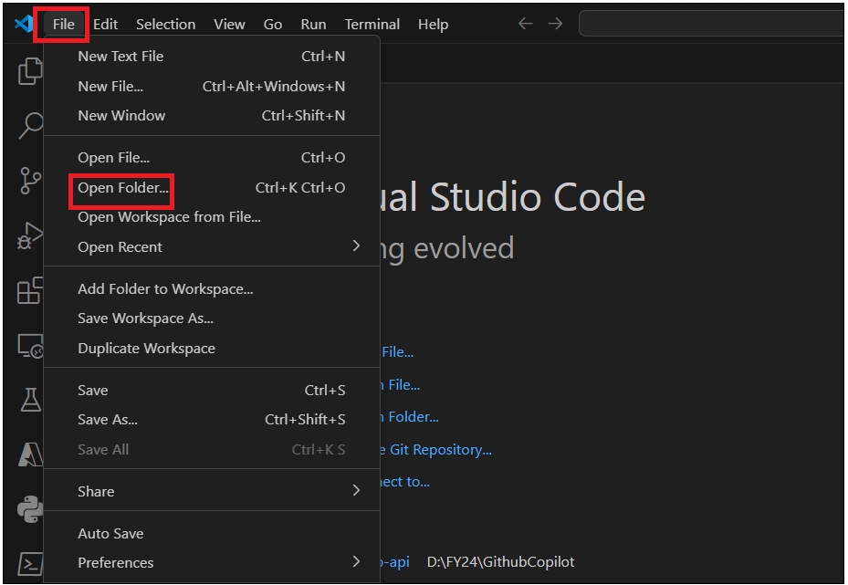
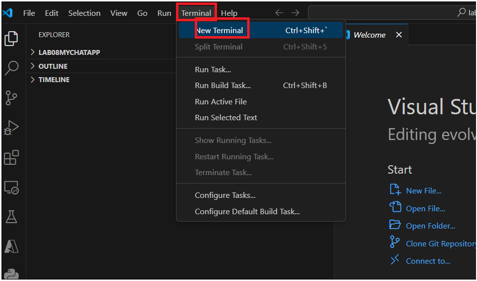
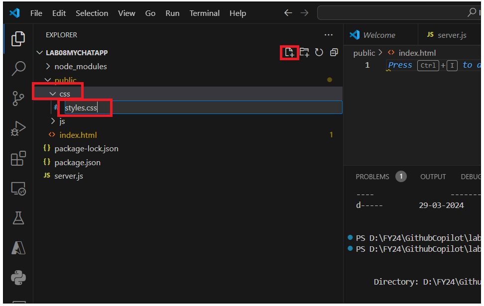
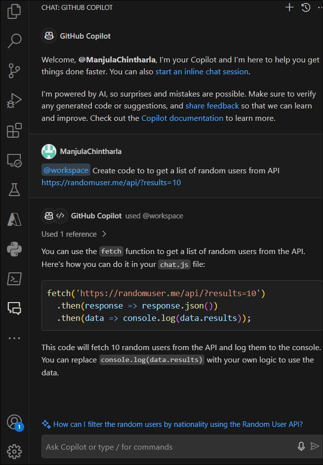
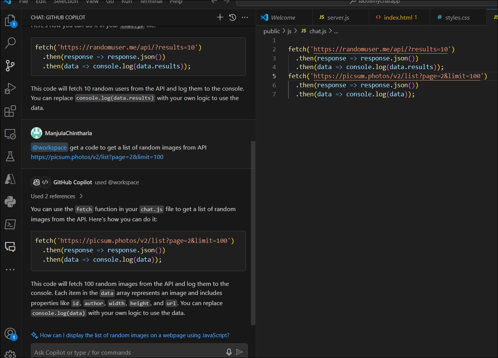
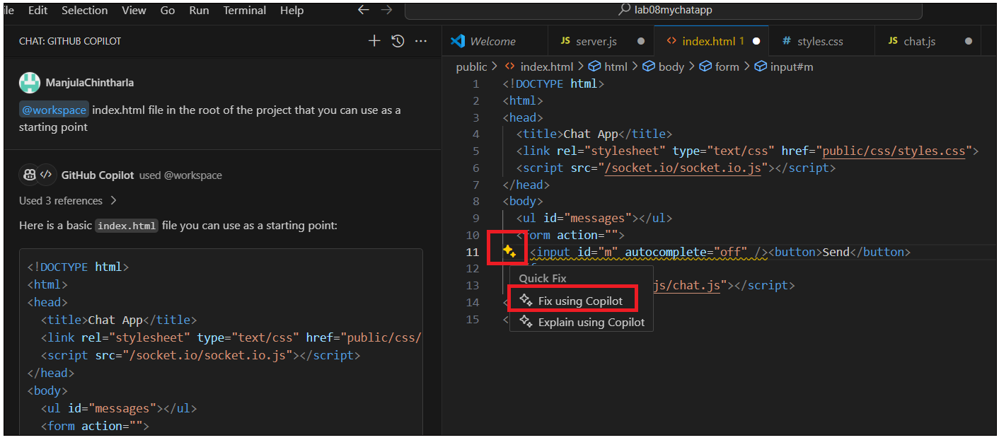
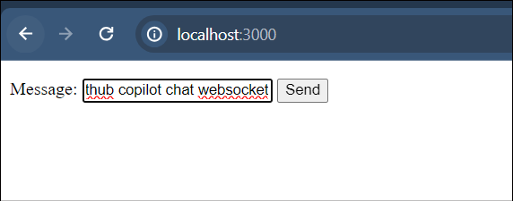

# **Lab 08 - Develop a chat based on WebSockets using Github Copilot**

## DESCRIPTION

The goal of this challenge is to develop a chat based on websockets. The
chat should allow users to send and receive messages in real time.

(Optional) The chat should also allow users to send and receive images.

(Optional) The chat should keep the session to start again from where it
was left off.

**Practical Copilot Techniques for Visual Studio Code**

-   Open a source file, write a comment description of what you want,
    type &lt;ENTER&gt;, and a suggestion should appear on the following
    line.

    -   If you like the suggestion, hit &lt;TAB&gt; on the keyboard to
        accept.

    -   If the suggestion is unacceptable and you want to type something
        else, type &lt;ESC&gt; on the keyboard to decline the
        suggestion. Then, you may continue typing.

    -   If no suggestion appears, or the suggestion disappears, and you
        want it back, then hit &lt;ALT&gt; + \\ on the keyboard; if
        there is a suggestion, it will appear.

    -   When there are multiple suggestions, to view them,
        type &lt;ALT&gt; + \] or &lt;ALT&gt; + \[ to cycle left and
        right through them. Also, you can hover over the suggestion with
        your mouse cursor to see more.

    -   To view multiple suggestions in a new editor tab,
        type &lt;CTRL&gt; + &lt;ENTER&gt; to open a new tab and review
        the generated suggestions.

**Useful Copilot Chat Techniques for Visual Studio Code**

-   To open a chat session to discuss a code snippet, highlight the code
    in the editor and type &lt;CTRL&gt;+i on Windows and Linux
    and &lt;CMD&gt;+i on macOS.

-   If you do not understand some lines of code, highlight them,
    right-click, and select Copilot → Explain This from the context
    menu.

-   If you want to fix some lines of code, highlight them, right-click,
    and choose Copilot → Fix This from the context menu.

-   To get help within Copilot Chat, open the chat panel, type in /help,
    and then hit &lt;ENTER&gt;. A good summary of available Copilot Chat
    commands will appear.

-   @&lt;some scope&gt; handles your prompts within a scope; there are
    three scopes: @workspace, @vscode, and @terminal

    -   @workspace is for creating new projects and managing existing
        projects.

    -   @vscode is for editor configuration and managing extensions.

    -   @terminal is for running commands in the terminal.

Copilot does not have access to the file system except for creating a
new project with the @workspace /new command. Copilot does not have
access to your entire solution or other code repositories when making
suggestions via Copilot.

## INSTRUCTIONS

### 1. Choose a programming language of your choice.

\- You can use the following API to get a list of random users
https://randomuser.me/api/?results=10

\- you can use the following API to get a list of random images
https://picsum.photos/v2/list?page=2&limit=100

\- you can use socket.io to implement the chat
https://socket.io/docs/v4/index.html

\- you have an initial index.html file in the root of the project that
you can use as a starting point

### 2. Develop the chat. You can use the following steps as a guide:

\- Allow users to send and receive messages in real time.

\- (Optional) Create a chat with a login screen.

\- (Optional) Allow users to send and receive images.

\- (Optional) Keep the session to start again from where it was left
off.

Use Copilot chat to support your learning and development. Use Copilot
to speed up your development.

**Task 1 – Create project folder strucutre.**

1.  Create a new folder for your project, e.g., !!**mychatapp**!! in
    your D:drive .

2.  Launch Visual Studio Code from your VM and click on **File -&gt;
    Open folder**.

3.  Select the project folder created in above step.

> 

4.  Click on **Terminal -&gt; New Terminal**.

> 

5.  Inside this folder, initialize a new Node.js project by running
    !!npm init -y!! in your terminal. This will create a
    **package.json** file.

6.  Install the necessary packages. By running command !!npm install
    express ws!!

> 

7.  Create a new file !!**server.js!!** in the root of your project.
    This will be your WebSocket server.

8.  Create a new folder **public**. This will hold all your static files
    like HTML, CSS, and client-side JavaScript. Run below command in
    terminal to create a folder

!!mkdir public!!

9.  Create a new file !!index.html!! file in the root of the project .
    This will be the main page of your chat application.

10. Inside the public folder, create two new folders: css and js. Run
    below commands to create folders.

> !!cd public!!

!!mkdir css!!

!!mkdir js!!

11. Inside the **css** folder, create a new file !!styles.css!!. This
    will hold all your CSS styles.

12. Inside the **js** folder, create a new file !!chat.js!!. This will
    be your client-side JavaScript code that interacts with the
    WebSocket server.

**Task 2 - Develop a chat based on wesockets.**

1\. To open a chat session to discuss a code snippet, highlight the code
in the editor and type &lt;CTRL&gt;+i on Windows

3\. Copilot Chat Prompt : !!@workspace Create code to to get a list of
random users from API https://randomuser.me/api/?results=10.! !

You can write your prompt as per your requirement

4\. Copilot Chat Responses with fetch function to get list of random
users from AP. Copy this code to **chat.js and save the file.**

5\. Ask Copilot for a code to get a list of random images from API.Copy
the function to **chat.js**

Copilot Chat Prompt

!! @workspace get a code to get a list of random images from API
<https://picsum.photos/v2/list?page=2&limit=100>!!

6\. Ask Copilot for a code to use **socket.io** to implement the chat

Copilot Chat Prompt

!!@workspace get a code for socket.io to implement the chat
https://socket.io/docs/v4/index.html!!

7\. To implement a basic chat with socket.io, you need to set up both
the server and the client side.Copy the code to **server.js**

8\. To implement a basic chat with socket.io,setup client side
([public/js/chat.js](vscode-file://vscode-app/c:/Users/ManjulaChintharla/AppData/Local/Programs/Microsoft%20VS%20Code/resources/app/out/vs/code/electron-sandbox/workbench/workbench.html)),
with below code and update **chat.js**

9\. Ask Copilot for a code to use index.html file in the root of the
project that can use as a starting point

Copilot Chat Prompt

!!@workspace index.html file in the root of the project that you can use
as a starting point!!

10\. Copy the code to **index.html** and save the file.

11\. You can see the warning at line \#11. Click on line \#11 yellow
mark and select **Fix using Copilot.**

13. Click on **Accept**, if you are okay with the fix provided by
    Copilot.

14. you need to set up Express to serve your **index.html** file when
    the root URL is accessed. Add below code to the **server.**js file
    just before the **server.listen.** This tells Express to respond
    with the index.html file when a GET request is made to the root URL

app.get('/', (req, res) =&gt; {

res.sendFile(\_\_dirname + '/index.html');

});

15. install socket.io in your project .Open Terminal and run  !!npm
    install socket.io!!

> 

16. To develop a chat, Allow users to send and receive messages in real
    time.Our setup already has allows users to send and receive messages
    in real time. Lets prompt Copilot to check the same

Copilot Chat Prompt

!!@workspace Allow users to send and receive messages in real time.!!

17. Open **Terminal** and start your server by running !!node
    server.js!! in your terminal.

18. Open a web browser and navigate to !!http://localhost:3000!!

> 
>
> 
