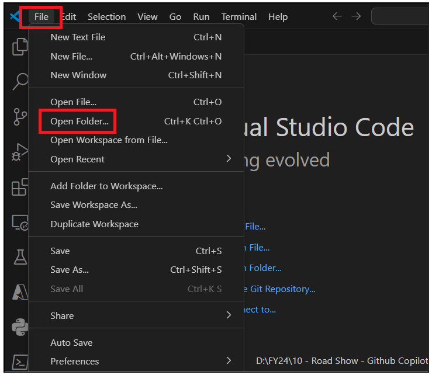
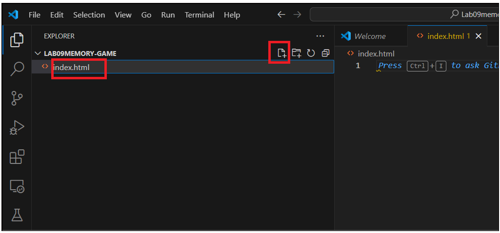
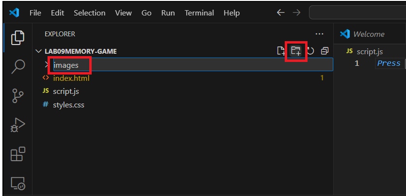
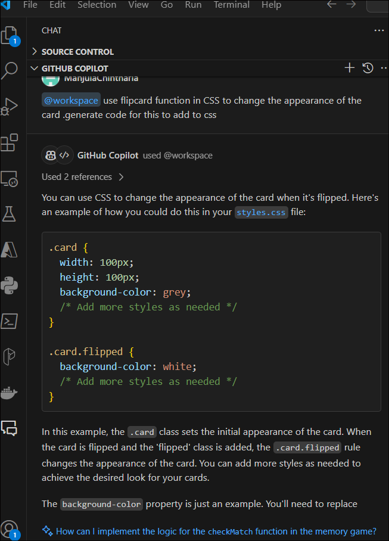
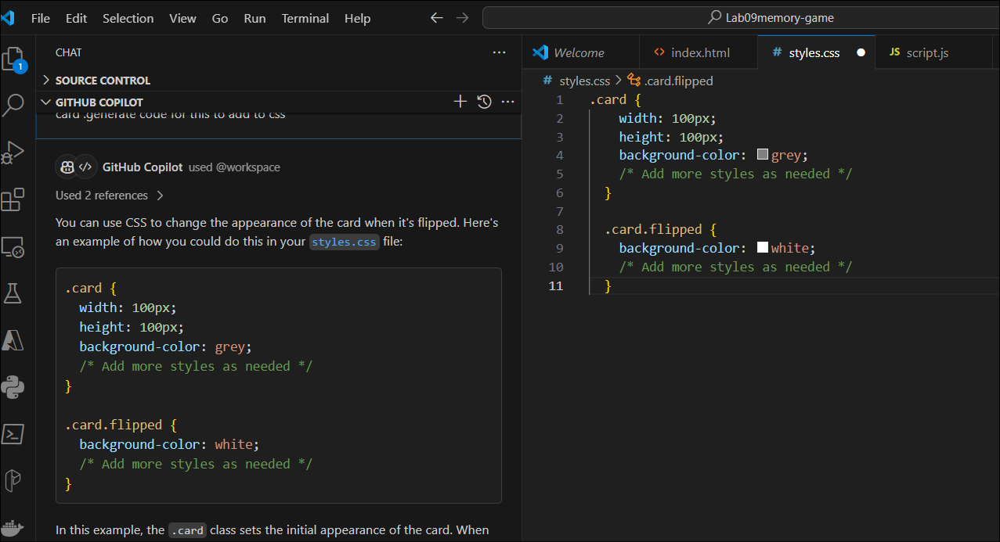
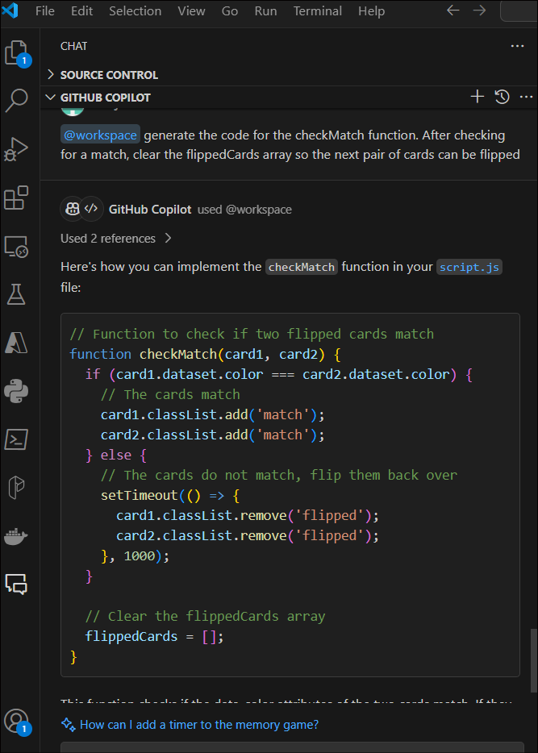
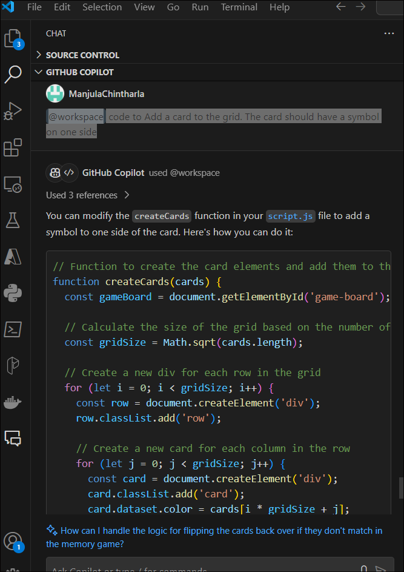

**Lab 10 Develop a memory game with the help of Github Copilot**

**Objective**

The goal of this lab is to develop a memory game. The game consists of a
grid of cards. Each card has a symbol on one side. The cards are
arranged randomly on the grid with the symbol face down. The player
flips two cards over each turn. If the two cards have the same symbol,
they remain face up. Otherwise, the cards flip back over after a short
period of time. The goal of the game is to match all pairs of cards.

**1. Choose a programming language of your choice.**

**2. Choose a topic for your cards. Some examples are:**

\- Colors

\- Star Wars characters (you can choose this API
https://akabab.github.io/starwars-api/\#alljson)

\- Pokemon characters (you can choose this API https://pokeapi.co/)

\- Countries (you can choose this API https://flagsapi.com/\#quick)

**3. Develop the game. You can use the following steps as a guide:**

\- Create a grid of cards. The grid should be 4x4, 6x6, or 8x8.

\- Choose a number of players. The game can be played by one or two
players.

\- Add a card to the grid. The card should have a symbol on one side.

\- Shuffle the cards on the grid.

\- Add a click event to each card. When the player clicks a card, the
card flips over.

\- When the player clicks two cards, check if the cards have the same
symbol. If the cards have the same symbol, the cards remain face up.
Otherwise, the cards flip back over.

\- When all pairs of cards are matched, the player wins the game.

Use Copilot chat to support your learning and development. Use Copilot
to speed up your development.

**Task 1: Develop the game**

1.  Open Visual Studio Code.

2.  Go to **File &gt; Open Folder**... and select the directory where
    you want to create your project. This will open the directory in
    Visual Studio Code.

> 

3.  In the Explorer pane on the left side of the screen, create a new
    folder. Name it !!**Lab09memory-game**!! And select it.

4.  With the **Lab09memory-game** folder selected, click on the New
    File icon to create new files. Create the following files:

    -   !!index.html!!

    -   !!styles.css!!

    -   !!script.js!!

5.  You can also create new folders for images and sounds by clicking on
    the New Folder icon.

6.  Remember to save your files (File &gt; Save or Ctrl+S) after adding
    code to them.

7.  Press Ctrl +Alt+I to open Github Copilot Chat and enter the below
    prompt.

!!@workspace Need to develop a memory game on the topic Colors. The game
consists of a grid of cards. Each card has a symbol on one side. The
cards are arranged randomly on the grid with the symbol face down. The
player flips two cards over each turn. If the two cards have the same
symbol, they remain face up. Otherwise, the cards flip back over after a
short period of time. The goal of the game is to match all pairs of
cards.!!

8.  Copilot generates a basic outline of code structure. Copy the code
    to script.js file and save it.

9.  We need to implement the logic for each function. The shuffleCards
    function could use the Fisher-Yates shuffle algorithm.

10. Ask Copilot below prompt. Copy the function code in the script.js
    file and save it.

> !!@workspace generate shuffleCards function with Fisher-Yates shuffle
> algorithm!!
>
> 

11. Ask the copilot to generate code for createCards function that will
    need to create HTML elements for each card and add them to the game
    board. Copy the code to **script.js** file.

> !!@workspace generate createCards function that will need to create
> HTML elements for each card and add them to the game board.!!
>
> 

12. createCards function creates a new div element for each card in the
    cards array, adds a CSS class for styling, and sets a data attribute
    with the color of the card. It also adds an event listener to handle
    the card flip when the card is clicked. The card is then added to
    the game board.

13. Now Lets have a container element with the id game-board in
    your [**index.html**](vscode-file://vscode-app/c:/Users/ManjulaChintharla/AppData/Local/Programs/Microsoft%20VS%20Code/resources/app/out/vs/code/electron-sandbox/workbench/workbench.html) file
    for this to work.Ask copilot

> !!@workspace Need code to have container element with the id
> game-board in your index.html file for createcretecards to work.!!
>
> 

14. Open index.html and copy the code. You can see an orange line under
    dive.Hover on div and select Quick fix.

> 

15. Select **Fix using Copilot.**

16. Click on the **Accept** button to accept the fix.

17. Now we need code to Function to handle the card flip.Lets ask
    Copilot

> !!@workspace flipCard function is called when a card is
> clicked..generate the code for this!!

18. Update the **script.js** file with the flipcard function.

> 

19. Use flipcard function in CSS to change the appearance of the
    card .Lets ask Copilot for the code.

> !!@workspace use flipcard function in CSS to change the appearance of
> the card .generate code for this to add to css!!
>
> 

20. Copy the code to styles.css and save the file.

21. Now, we need to implement the logic for the **checkMatch** function.
    After checking for a match, you should clear
    the **flippedCards** array so the next pair of cards can be
    flipped.Ask Copilot for code.

!!@workspace generate the code for the checkMatch function. After
checking for a match, clear the flippedCards array so the next pair of
cards can be flipped!!

22. Copy the code to **script.js** file

23. Now, lets use the 'match' class in your CSS to change the appearance
    of cards. Ask copilot

!!@workspace code to use match' class in styles.CSS to change the
appearance of matched cards.!!

24. Copy the code to styles.css

> 

25. We need to create a grid of cards. Let's ask Copilot same.

> !!@workspace code to Create a grid of cards. The grid should be 4x4,
> 6x6, or 8x8.!!
>
> 

26. We need to update **createCards** function in
    [**script.js**](vscode-file://vscode-app/c:/Users/ManjulaChintharla/AppData/Local/Programs/Microsoft%20VS%20Code/resources/app/out/vs/code/electron-sandbox/workbench/workbench.html) file.
    Also, need to update CSS
    in **[styles.css](vscode-file://vscode-app/c:/Users/ManjulaChintharla/AppData/Local/Programs/Microsoft%20VS%20Code/resources/app/out/vs/code/electron-sandbox/workbench/workbench.html) **to
    display the cards in a grid layout. Make necessary code changes
    suggested by Copilot.

> 
>
> 
>
> This will create a grid of cards where the number of rows and columns
> is equal to the square root of the total number of cards. The cards
> will be evenly distributed across the rows and centered on the page.

27. We need **Copilot's** help to choose a number of players for the
    game.

> !!@workspace code to Choose a number of players. The game can be
> played by one or two players.!!
>
> 

28. We need to add a function to choose the number of players at the
    start of the game. Modify the **startGame** function in
    your [script.js](vscode-file://vscode-app/c:/Users/ManjulaChintharla/AppData/Local/Programs/Microsoft%20VS%20Code/resources/app/out/vs/code/electron-sandbox/workbench/workbench.html) file:Update
    the code as per Copilot’s suggestion.

This will prompt the user to enter the number of players when the game
starts. If the user enters a valid number (1 or 2), the game will be set
up for that number of players. If the user enters an invalid number, the
game will default to 1 player.

> 

29. Add code to Add a card to the grid. The card should have a symbol on
    one side

> !!@workspace code to Add a card to the grid. The card should have a
> symbol on one side!!

30. Modify the **createCards** function in
    your **[script.js](vscode-file://vscode-app/c:/Users/ManjulaChintharla/AppData/Local/Programs/Microsoft%20VS%20Code/resources/app/out/vs/code/electron-sandbox/workbench/workbench.html) f**ile
    to add a symbol to one side of the card as per Copilot’s code.

> This will add a new div to each card with the class symbol. The text
> content of the symbol div is set to the color of the card, but you can
> replace this with any symbol you want. The symbol will be visible when
> the card is flipped
>
> 

31. Add code to Add a click event to each card. When the player clicks a
    card, the card flips over.

> !!@workspace code to Add a click event to each card. When the player
> clicks a card, the card flips over.!
>
> 

32. Update the **createCards** function in
    **[script.js](vscode-file://vscode-app/c:/Users/ManjulaChintharla/AppData/Local/Programs/Microsoft%20VS%20Code/resources/app/out/vs/code/electron-sandbox/workbench/workbench.html)
    .**Add the below line of code to add a click event to each card.

> // Add a click event to the card
>
>       card.addEventListener('click', () =&gt; flipCard(card));

The \`flipCard\` function is called when a card is clicked. This
function flips the card over by adding the 'flipped' class to the card.

33. Generate code to When all pairs of cards are matched, the player
    wins the game.

!!@workspace generate code When all pairs of cards are matched, the
player wins the game.!!

34. Update the **checkMatch** function to see if all pairs of cards have
    been matched. If all cards have been matched, you can display a
    winning message

> 

35. Locate
    the [**index.html**](vscode-file://vscode-app/c:/Users/ManjulaChintharla/AppData/Local/Programs/Microsoft%20VS%20Code/resources/app/out/vs/code/electron-sandbox/workbench/workbench.html) file
    in your project directory.

> 

36. Right-click on the file and select "Open with".

37. Choose a web browser (like Google Chrome, Firefox, etc.) from the
    list of applications.

38. The game should now be running in your web browser. If you make
    changes to the code, you'll need to refresh the page in your browser
    to see the effects.

> 
