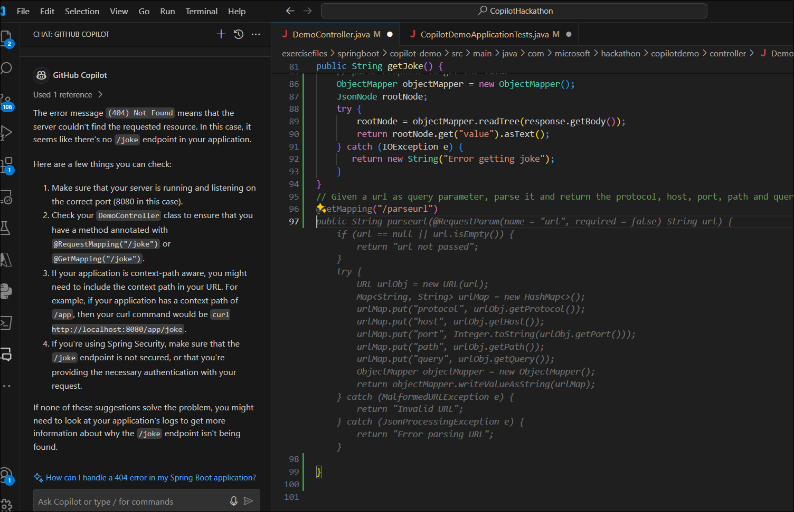
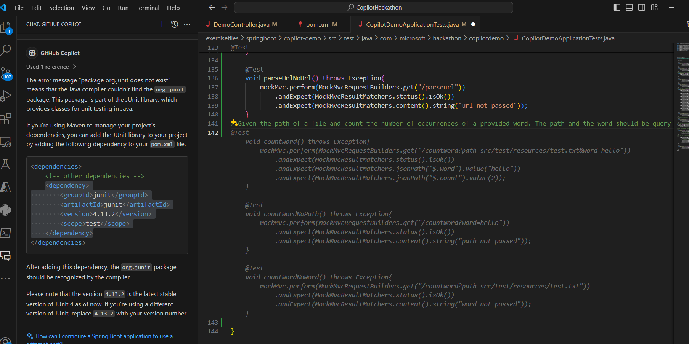
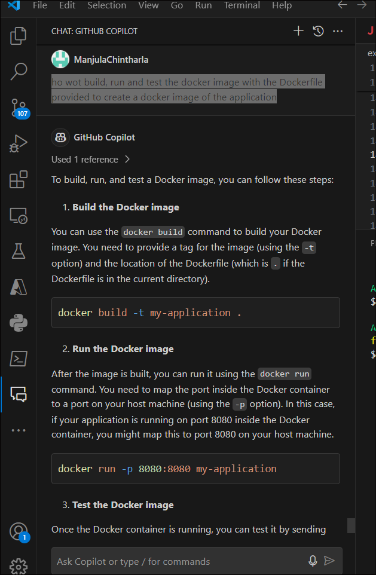
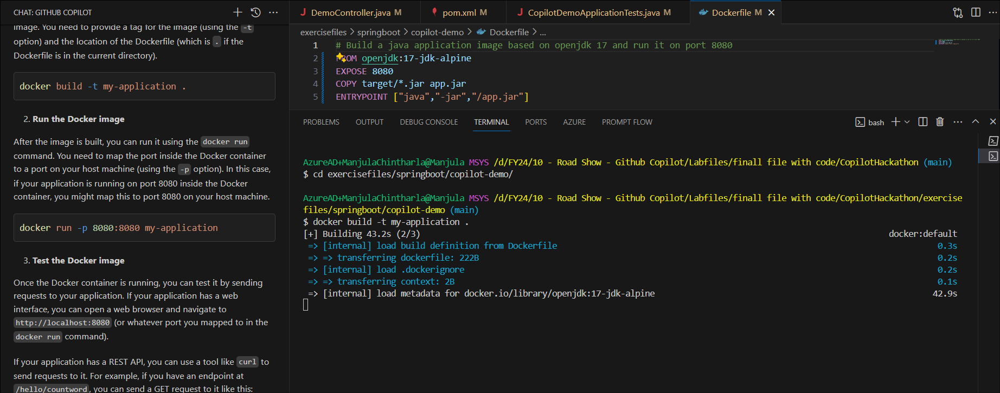

**Lab 02 - Build a REST API using Spring Boot with the help of GitHub
Copilot**

**Goal**

The goal of this lab is to learn how to use GitHub Copilot, using an
exercise that consists of building a REST API using Spring Boot.

We have created a Spring Boot project with some files already created,
you can find the project in the folder **exercisefiles/springboot**.

Let's start copiloting!!!

### Task 1 : Configuring your GitHub account

With a user account on GitHub, you can import or create repositories,
collaborate with others, and connect with the GitHub community.

1.  Open browser and navigate to
    [**https://github.com/**](urn:gd:lg:a:send-vm-keys)

2.  Enter your own personal account/ work email account and then click
    on sign up for GitHub

3.  Click on **Continue**

4.  Enter password and then click on **continue**

5.  Enter Username and then click on continue

6.  Enter 'n' for no updates required then click on **continue**.

7.  Complete the puzzle and then click on **Create account**.

8.  Enter the code which was sent your register email

9.  Click on skip personalization

10. You successfully have signup to Github

### **Task 2 : Activate Copilot license**

**If you still do not have an active Copilot license, a 30 day trial can
be requested with below steps . Make sure to cancel your license before
the trial ends to avoid getting billed**

11. Open a new tab in your browser and go to Signup to GitHub Copilot -
    [**https://github.com/github-copilot/signup**](urn:gd:lg:a:send-vm-keys)

12. Click on **Get access to GitHub Copilot** button.

13. Enter billing information with your personal credit card and then
    click on **Save**.

14. Enter your billing information and then click on **Save payment
    information** button.

IMPORTANT: Make sure to deactivate the account after you complete the
labs to avoid billing for usage.

### **Task 3 : Install required extensions in Visual studoio code**

15. Open Visual Studio Code from the Windows Start menu .Click on
    **Accounts -&gt; Backup and Sync Settings** and select **Sign in.**

16. Select **Sign in with Github** option

17. Sect the Browser and Sign in with your Copilot enabled Github
    account.

18. Authenticate and verify with the code to complete Twofactor
    authentication.

19. Click on Visual Studio Code.

20. Click on Extension from left navigation menu, search for [**Github
    Copilot**](urn:gd:lg:a:send-vm-keys), select it and click on
    **Install**.

21. Search for [**Docker**](urn:gd:lg:a:send-vm-keys) and install it
    from Microsoft.

22. Search for [**Extension Pack for JAVA**](urn:gd:lg:a:send-vm-keys)
    ,select it and **install** it.

23. Search for [**Jupyter**](urn:gd:lg:a:send-vm-keys),seelct it and
    **install** it.

24. Search Python, select the one from Microsoft and **install** it.

**Task 4 : Create the code to handle a simple GET request**

Move to the 'DemoController.java' file and start writing the code to
handle a simple GET request. In this first exercise, we have provided a
comment that describes the code you need to generate. Just press enter
and wait a couple of seconds, Copilot will generate the code for you.

There is already a unit test implemented for this exercise, you can run
it using the command mvn test before and after to validate that the code
generated by Copilot is correct.

Then, create a new unit test for the case when no key is provided in the
request.

After every exercise, feel free to package and run your application to
test it.

Package: mvn package

Run: mvn spring-boot:run

Test: curl -v <http://localhost:8080/hello?key=world>

1.  Expand the **CopilotHackathon-&gt;exercisefiles -&gt; Springboot**
    **-&gt; copilot-demo -&gt;
    src-&gt;java\\com\\microsoft\\hackathon\\copilotdemo\\controller**
    folder under **Explorer** . Click on **'DemoController.java**. In
    this first exercise, only a comment is provided that describes the
    code you need to generate.

2.  Take the cursor at the end of the comment (line 12) just press enter
    and wait a couple of seconds, **Copilot** will generate the code for
    you. Press the tab until it gives you the full code.

You can also press Ctrl + Enter to choose code options.

3.  Expand the **test** folder and click on
    **CopilotDemoApplicationTests.java.**The unit test is already given
    to you.

4.  You can try running the code without updating pom xml and ask
    Coiplot for a solution to explore the product.

5.  Open **Pom.xml** add the below plugin and save the file

        &lt;plugin&gt;

            &lt;groupId&gt;org.apache.maven.plugins&lt;/groupId&gt;

            &lt;artifactId&gt;maven-compiler-plugin&lt;/artifactId&gt;

            &lt;version&gt;3.8.1&lt;/version&gt;

            &lt;configuration&gt;

                &lt;source&gt;17&lt;/source&gt;

                &lt;target&gt;17&lt;/target&gt;

            &lt;/configuration&gt;

        &lt;/plugin&gt;

6.  Click on **Terminal -&gt; New Terminal** from the toolbar.

7.  Select **Gitbash** and run the below command.

> !!cd exercisefiles/springboot/copilot-demo/!!
>
> 
>
> 

8.  Run !!mvn clean install -DskipTests!! command

9.  Run !!mvn test!! .If your build fail with error.

10. Click on the **Copilot** icon on right-down corner and select
    **Github Copilot Chat**.

11. Ask Github Copilot chat to provide a fix for your error.

12. Look at the Copilot chat explaining the issue and the corresponding
    fix . If you are still not clear with the fix, keep asking your
    doubts and Copilot will answer you .Read and understand the error
    and the solution to implement.

13. Provide the /hello method to Copilot and let’s see what it will
    suggest.

14. Go back to the **CopilotDemoApplicationTests.java .**Take the cursor
    at the end of the test (line 24) and press Enter. Copilot generates
    another test for you. Press the tab to accept it.

15. Provide /hello method from test to Copilot and see what it will
    suggest.

19\. Re-run the !!mvn test!! Your code can look like below. You can also
write your own code and ask Copilot to validate.

@RestController

public class DemoController {

@GetMapping("/hello")

public String hello(@RequestParam(name = "key", required = false) String
key) {

if (key == null) {

return "key not passed";

}

return "hello " + key;

}

}

16. Run !!mvn package!! command

17. Run  !!mvn spring-boot:run!!

18. Click on split the terminal and enter !!curl -v
    <http://localhost:8080/hello?key=world>!! in the 2^(nd) terminal
    .You can also ask your Copilot to provide curl command to test for
    your code.

19. Click on split the terminal and enter !!curl -v
    [http://localhost:8080/hello](http://localhost:8080/hello?key=world)!!
    in the 2^(nd) terminal

20. Press Ctrl +C to stop the running service.

**Task 2 : Dates comparison**

New operation under /diffdates that calculates the difference between
two dates. The operation should receive two dates as parameter in format
dd-MM-yyyy and return the difference in days.

Additionally, create a unit test that validates the operation.

From now on, you will have to create the unit tests for every new
operation. Wasn't it easy with Copilot?

1.  Go to **DemoController.java** and enter the prompt !!//create a New
    operation under /diffdates that calculates the difference between
    two dates. The operation should receive two dates as parameter in
    format dd-MM-yyyy and return the difference in days!! and press
    Enter. Wait for some time and once the copilot predicts the code
    then press the tab to accept the code.

> 

2.  You can also use the below code.

> @GetMapping("/diffdates")
>
> public String diffdates(@RequestParam(name = "date1", required =
> false) String date1, @RequestParam(name = "date2", required = false)
> String date2) throws ParseException {
>
> if (date1 == null || date2 == null) {
>
> return "date not passed";
>
> }
>
> SimpleDateFormat sdf = new SimpleDateFormat("dd-MM-yyyy");
>
> Date date1Obj = sdf.parse(date1);
>
> Date date2Obj = sdf.parse(date2);
>
> long diffInMillies = Math.abs(date2Obj.getTime() -
> date1Obj.getTime());
>
> long diff = TimeUnit.DAYS.convert(diffInMillies,
> TimeUnit.MILLISECONDS);
>
> return "difference in days: " + diff;
>
> }
>
> 

3.  From now on, you will have to create the unit tests for every new
    operation. Use Copilot to create.

4.  Open **CopilotDemoApplicationTests.java** under the **test** folder
    and enter the prompt !!// create unit test to /diffdates that
    calculates the difference between two dates. The operation should
    receive two dates as parameter in format dd-MM-yyyy and return the
    difference in days.!! then press Enter. Wait for a sec to copilot to
    predict the code and press tab to accept the predicted code.

5.  You can enter and press tab to create multiple unit tests

6.  Take Copilot chat help for issues to fix or to explain the unittest
    and update code if required based on Copilot inputs.

> @Test
>
> void diffdates() throws Exception {
>
> mockMvc.perform(MockMvcRequestBuilders.get("/diffdates?date1=01-01-2021&date2=01-02-2021"))
>
> .andExpect(MockMvcResultMatchers.status().isOk())
>
> .andExpect(MockMvcResultMatchers.content().string("difference in days:
> 31"));
>
> }
>
> @Test
>
> void diffdatesNoDate1() throws Exception {
>
> mockMvc.perform(MockMvcRequestBuilders.get("/diffdates?date2=01-02-2021"))
>
> .andExpect(MockMvcResultMatchers.status().isOk())
>
> .andExpect(MockMvcResultMatchers.content().string("date not passed"));
>
> }
>
> @Test
>
> void diffdatesNoDate2() throws Exception {
>
> mockMvc.perform(MockMvcRequestBuilders.get("/diffdates?date1=01-01-2021"))
>
> .andExpect(MockMvcResultMatchers.status().isOk())
>
> .andExpect(MockMvcResultMatchers.content().string("date not passed"));
>
> }

7.  Open **Terminal -&gt;Gitbash** and run below commands

!!cd “exercisefiles\\springboot\\copilot-demo”!!

!!mvn test!!

8.  If you see compilation errors then copy the error message and ask
    Copilot for the fix.

9.  Copolit suggest you to import packages with code. Add the command to
    your code and run !!mvn test!!

10. Run !!mvn package!!

11. Run the test !!mvn -Dtest=CopilotDemoApplicationTests\#diffdates
    test!!

12. Run !!mvn spring-boot:run!!

13. Click on Split terminal and run  !!curl -v
    <http://localhost:8080/diffdates?date1=01-01-2021&date2=01-02-2021>!!

> You will see an error. Take Copilot help and fix the small issue.
>
> 

14. As Copilot Chat to help you with curl command .Just copy the error
    message as paste into chat. Copilot gives you the modified command
    with explanation

> 

**Task 3 : Validate the format of a Spanish phone**

Validate the format of a spanish phone number (+34 prefix, then 9
digits, starting with 6, 7 or 9). The operation should receive a phone
number as parameter and return true if the format is correct, false
otherwise.

1.  Open DemoController.Java and enter the prompt !! // Validate the
    format of a spanish phone number (+34 prefix, then 9 digits,
    starting with 6, 7 or 9). The operation should receive a phone
    number as parameter and return true if the format is correct, false
    otherwise.!! .Press tab to accept the code.

2.  You can also use below code.

// Validate the format of a spanish phone number (+34 prefix, then 9
digits, starting with 6, 7 or 9). The operation should receive a phone
number as parameter and return true if the format is correct, false
otherwise.

@GetMapping("/validatephone")

public boolean validatephone(@RequestParam(name = "phone", required =
false) String phone) {

if (phone == null || phone.isEmpty()) {

return false;

}

String regex = "^\\\\+34\[679\]\\\\d{8}$";

return phone.matches(regex);

}

3.  Switch to **CopilotDemoApplicationTests.java**. To write a unit test
    to test for the above function, add !!//Write unit test to validate
    the format of a spanish phone number (+34 prefix, then 9 digits,
    starting with 6, 7 or 9). The operation should receive a phone
    number as parameter and return true if the format is correct, false
    otherwise!! Press Enter. Press the tab to accept the code.

4.  You can also use the below unit tests or you can write your own unit
    tests.

@Test

void validatephone() throws Exception {

mockMvc.perform(MockMvcRequestBuilders.get("/validatephone?phone=+34666666666"))

.andExpect(MockMvcResultMatchers.status().isOk())

.andExpect(MockMvcResultMatchers.content().string("true"));

mockMvc.perform(MockMvcRequestBuilders.get("/validatephone?phone=+34766666666"))

.andExpect(MockMvcResultMatchers.status().isOk())

.andExpect(MockMvcResultMatchers.content().string("true"));

mockMvc.perform(MockMvcRequestBuilders.get("/validatephone?phone=+34966666666"))

.andExpect(MockMvcResultMatchers.status().isOk())

.andExpect(MockMvcResultMatchers.content().string("true"));

mockMvc.perform(MockMvcRequestBuilders.get("/validatephone?phone=+3466666666"))

.andExpect(MockMvcResultMatchers.status().isOk())

.andExpect(MockMvcResultMatchers.content().string("false"));

mockMvc.perform(MockMvcRequestBuilders.get("/validatephone?phone=+346666666666"))

.andExpect(MockMvcResultMatchers.status().isOk())

.andExpect(MockMvcResultMatchers.content().string("false"));

mockMvc.perform(MockMvcRequestBuilders.get("/validatephone?phone=+3466666666a"))

.andExpect(MockMvcResultMatchers.status().isOk())

.andExpect(MockMvcResultMatchers.content().string("false"));

mockMvc.perform(MockMvcRequestBuilders.get("/validatephone?phone=+34866666666"))

.andExpect(MockMvcResultMatchers.status().isOk())

.andExpect(MockMvcResultMatchers.content().string("false"));

}

@Test

void validatephoneNoPhone() throws Exception {

mockMvc.perform(MockMvcRequestBuilders.get("/validatephone"))

.andExpect(MockMvcResultMatchers.status().isOk())

.andExpect(MockMvcResultMatchers.content().string("false"));

}

5.  Open **Terminal -&gt;Gitbash** and run the below commands.

> !!cd exercisefiles/springboot/copilot-demo/!!
>
> !!mvn test!!

6.  Run !!mvn package!!

7.  Run !!mvn spring-boot:run!!

8.  Split the terminal and run the below curl commands to validate the
    phone numbers.

!!curl -v http://localhost:8080/validatephone?phone=+34866666666!!

!!curl -v http://localhost:8080/validatephone?phone=+34666666667!!

!!curl -v http://localhost:8080/validatephone?phone=+34666666666!!

**Task 4 : Validate the format of a spanish DNI**

Validate the format of a spanish DNI (8 digits and 1 letter). The
operation should receive a DNI as parameter and return true if the
format is correct, false otherwise.

1.  Open DemoController.Java and enter the prompt !! // Validate the
    format of a spanish DNI (8 digits and 1 letter). The operation
    should receive a DNI as parameter and return true if the format is
    correct, false otherwise.!! .Press the tab to accept the code.

2.  You can also use the below code

// Validate the format of a spanish DNI (8 digits and 1 letter). The
operation should receive a DNI as parameter and return true if the
format is correct, false otherwise.

@GetMapping("/validatedni")

public boolean validatedni(@RequestParam(name = "dni", required = false)
String dni) {

if (dni == null || dni.isEmpty()) {

return false;

}

String regex = "^\\\\d{8}\[A-Z\]$";

return dni.matches(regex);

}

3.  Switch to **CopilotDemoApplicationTests.java**. To write a unit test
    to test for the above function, add !!//Write unit test to Validate
    the format of a spanish DNI (8 digits and 1 letter). The operation
    should receive a DNI as parameter and return true if the format is
    correct, false otherwise!! Press Enter. Press the tab to accept the
    code.

4.  You can also use the below unit test or you can write your own unit
    tests.

@Test

void validatedniNoDni() throws Exception {

mockMvc.perform(MockMvcRequestBuilders.get("/validatedni"))

.andExpect(MockMvcResultMatchers.status().isOk())

.andExpect(MockMvcResultMatchers.content().string("false"));

}

5.  Open Terminal -&gt; Gitbash and run the below commands.

!!cd exercisefiles/springboot/copilot-demo/!!

!!mvn test!!

6.  Run !!mvn package!!

7.  Run !!mvn spring-boot:run!!

8.  Split terminal and run !!curl -v
    <http://localhost:8080/validatedni?dni=12345678C!!in> the 2^(nd)
    terminal

**Task 5 : From color name to hexadecimal code**

Based on existing colors.json file under resources, given the name of
the color as path parameter, return the hexadecimal code. If the color
is not found, return 404

Hint: Use TDD. Start by creating the unit test and then implement the
code.

1.  Open DemoController.Java and enter the prompt !! // Based on
    existing colors.json file under resources, given the name of the
    color as path parameter, return the hexadecimal code. If the color
    is not found, return 404!! .Press the tab to accept the code.

2.  You can also use below code or you can write your code.

//Based on existing colors.json file under resources, given the name of
the color as path parameter, return the hexadecimal code. If the color
is not found, return 404

@GetMapping("/color/{name}")

public ResponseEntity&lt;String&gt; color(@PathVariable("name") String
name) throws IOException {

InputStream inputStream =
getClass().getClassLoader().getResourceAsStream("colors.json");

ObjectMapper objectMapper = new ObjectMapper();

// create JsonNode from mapper

JsonNode rootNode = objectMapper.readTree(inputStream);

for (JsonNode color : rootNode) {

// if color name is found, return the hex code

if (color.get("color").asText().equals(name)) {

return new
ResponseEntity&lt;String&gt;(color.get("code").get("hex").asText(),
HttpStatus.OK);

}

}

return new ResponseEntity&lt;String&gt;("Color not found",
HttpStatus.NOT\_FOUND);

}

3.  Switch to **CopilotDemoApplicationTests.java**. To write a unit test
    to test for the above function, add !!//test for /color/{color}
    endpoint!! Press Enter. Press the tab to accept the code.

4.  You can write your unit tests. You can always check with Copilot for
    any code/fix /unit test

5.  Open **Terminal -&gt; Gitbash** and run below commands.You can see
    compilation erros.

!!cd exercisefiles/springboot/copilot-demo/!!

!!mvn test!!

> 

6.  Press **Ctrl +Alt+ I** to open **Github Copilot Chat**.Copy the
    error message and paste in the chat window. Copilot suggest with the
    solution.

> 

7.  Copilot suggests you import missing packages with the import
    function. Copy it and add it to your code. Press Enter and Copilot
    suggests you to add missing packages. Press the tab and accept them
    to add to the code.

> 
>
> 

8.  Open **Terminal -&gt;Gitbash** and run the below commands again.

> !!cd exercisefiles/springboot/copilot-demo/!!
>
> !!mvn test!!
>
> 
>
> 

9.  Run !!mvn package!! To package your application.

> 
>
> 

10. Run !!mvn spring-boot:run!! To test

11. You can ask your copilot to help with curl command to test your
    function.

> 

12. Click on **Split terminal** and run curl command to test your
    application.(Update the port)

> 

13. Test with colors listed in **colors.json** file

14. Test the color that is not listed in **colors.json** and see the
    results

> 

**Task 6 : Jokes creator**

Create a new operation that calls the
API [*https://api.chucknorris.io/jokes/random*](https://api.chucknorris.io/jokes/random) and
returns the joke.

1.  Open DemoController.Java and enter the prompt !! // new operation
    that call the API https://api.chucknorris.io/jokes/random and return
    the joke!! .Press the tab to accept the code.

9.  You can also use below code.

// new operation that call the API
https://api.chucknorris.io/jokes/random and return the joke

@GetMapping("/joke")

public String getJoke() {

RestTemplate restTemplate = new RestTemplate();

String url = "https://api.chucknorris.io/jokes/random";

ResponseEntity&lt;String&gt; response = restTemplate.getForEntity(url,
String.class);

// parse response to get the value

ObjectMapper objectMapper = new ObjectMapper();

JsonNode rootNode;

try {

rootNode = objectMapper.readTree(response.getBody());

return rootNode.get("value").asText();

} catch (IOException e) {

return new String("Error getting joke");

}

}

10. Switch to **CopilotDemoApplicationTests.java**. To write a unit test
    to test for the above function, add !! // Create a unit test for new
    operation that call the API https://api.chucknorris.io/jokes/random
    and return the joke!! Press Enter. Press the tab to accept the code.

11. You can also add below unit test or you can write your own unit
    tests.

@Test

void joke() throws Exception{

mockMvc.perform(MockMvcRequestBuilders.get("/joke"))

.andExpect(MockMvcResultMatchers.status().isOk())

// check that content is a string

.andExpect(MockMvcResultMatchers.content().string(Matchers.any(String.class)));

}

12. Open Terminal - &gt; Gitbahs and run below commands .

!!cd exercisefiles/springboot/copilot-demo/!!

> !!mvn test!!

13. Package your application. Run !!mvn package!!

14. Run !!mvn spring-boot:run!!

15. Click on Split terminal and run command to : !!curl -v
    <http://localhost:8080/joke>!! in 2^(nd) terminal

**Task 7 : URL parsing**

Given a url as query parameter, parse it and return the protocol, host,
port, path and query parameters. The response should be in Json format.

1.  Open **DemoController.Java** and enter the prompt !! //write a code
    for Given a url as query parameter, parse it and return the
    protocol, host, port, path and query parameters. The response should
    be in Json format!! .Press the tab to accept the code.

2.  You can also use the below code.

// Given a url as query parameter, parse it and return the protocol,
host, port, path and query parameters. The response should be in Json
format.

@GetMapping("/parseurl")

public String parseurl(@RequestParam(name = "url", required = false)
String url) throws MalformedURLException {

if (url == null || url.isEmpty()) {

return "url not passed";

}

URL urlObj = new URL(url);

String protocol = urlObj.getProtocol();

String host = urlObj.getHost();

int port = urlObj.getPort();

String path = urlObj.getPath();

String query = urlObj.getQuery();

return "{ \\"protocol\\": \\"" + protocol + "\\", \\"host\\": \\"" +
host + "\\", \\"port\\": \\"" + port + "\\", \\"path\\": \\"" + path +
"\\", \\"query\\": \\"" + query + "\\" }";

}

3.  Switch to **CopilotDemoApplicationTests.java**. To write a unit test
    to test for the above function, add !! // Create a unit test for new
    operation that call the API https://api.chucknorris.io/jokes/random
    and return the joke!! Press Enter. Press the tab to accept the code.

> 

4.  You can also add below unit tests or write your own unit tests.

@Test

void parseUrl() throws Exception{

mockMvc.perform(MockMvcRequestBuilders.get("/parseurl?url=https://learn.microsoft.com/en-us/azure/aks/concepts-clusters-workloads?source=recommendations"))

.andExpect(MockMvcResultMatchers.status().isOk())

// validate json fields

.andExpect(MockMvcResultMatchers.jsonPath("$.protocol").value("https"))

.andExpect(MockMvcResultMatchers.jsonPath("$.host").value("learn.microsoft.com"))

.andExpect(MockMvcResultMatchers.jsonPath("$.path").value("/en-us/azure/aks/concepts-clusters-workloads"))

.andExpect(MockMvcResultMatchers.jsonPath("$.query").value("source=recommendations"));

}

@Test

void parseUrlNoUrl() throws Exception{

mockMvc.perform(MockMvcRequestBuilders.get("/parseurl"))

.andExpect(MockMvcResultMatchers.status().isOk())

.andExpect(MockMvcResultMatchers.content().string("url not passed"));

}

5.  Open **Terminal -&gt; Gitbash** and run the below commands.

> !! cd exercisefiles/springboot/copilot-demo/!!
>
> !!mvn test!!
>
> 

2\. Ru !!mvn package!! To package your application.

4\. Run !!mvn spring-boot:run!!

4\. Split the terminal and test your application : !!curl -v
<http://localhost:8080/parseurl?url=https://www.google.com/search?q=chuck+norris>!!

**Task 8 : Word counting**

Given the path of a file and count the number of occurrences of a
provided word. The path and the word should be query parameters. The
response should be in Json format.

1.  Open **DemoController.Java** and enter the prompt !! //write a code
    for Given the path of a file and count the number of occurrences of
    a provided word. The path and the word should be query parameters.
    The response should be in Json format!! .Press the tab to accept the
    code.

2.  Switch to **CopilotDemoApplicationTests.java**. To write a unit test
    to test for the above function, add !! // Given the path of a file
    and count the number of occurrences of a provided word. The path and
    the word should be query parameters. The response should be in Json
    format.!! Press Enter. Press the tab to accept the code.

3.  Open Terminal -&gt; Gitbash and run below commands.

!!cd exercisefiles/springboot/copilot-demo/!!

!!mvn test!!

4.  Run !!mvn package!! to package your application/

5.  Run !!mvn spring-boot:run!!

> 

6.  Click on Split terminal and run curl command to test your
    application.

> !!curl
> <http://localhost:8080/countword?path=src/test/resources/test.txt>!!
>
> 

**Task 9 : Containerize the application**

Use the Dockerfile provided to create a docker image of the application.
There are some comments in the Dockerfile that will help you to complete
the exercise.

In order to build, run and test the docker image, you can use Copilot as
well to generate the commands.

For instance, create a DOCKER.md file where you can store the commands
to build, run and test the docker image. You will notice that Copilot
will also help you to document your project and commands.

Examples of steps to document: Build the container image, Run the
container, Test the container.

1.  Double click on Docker from Dekstop and sign in with your account.

2.  Open the Docker file om Visual studio code add the below code to it
    and save the file.

> \# Build a java application image based on openjdk 17 and run it on
> port 8080
>
> FROM openjdk:17-jdk-alpine
>
> EXPOSE 8080
>
> COPY target/\*.jar app.jar
>
> ENTRYPOINT \["java","-jar","/app.jar"\]
>
> 

3.  Press **Ctrl +Alt +I** to open **GitHub Copilot** chat window. Ask
    Copilot below prompt.Copilot provides steps to containerize the
    application.

!! how to build, run and test the docker image with the Dockerfile
provided to create a docker image of the application!!

4.  Follow the 1^(st) step- Build the Docker image. Open **Terminal
    -&gt; Gitbash** and run the command to build the Docker image.

!!cd exercisefiles/springboot/copilot-demo/!!

!!docker build -t my-application .!!

5.  After the image is built, you can run it using the docker
    run command.

!!docker run -p 8080:8080 my-application!!

6.  Once the Docker container is running, you can test it by sending
    requests to your application.

! !curl <http://localhost:8080/hello?key=world>!!

