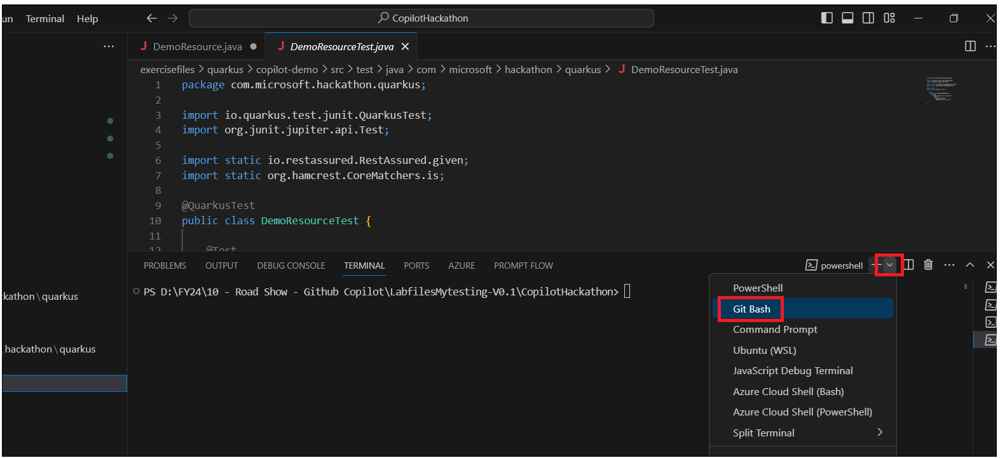
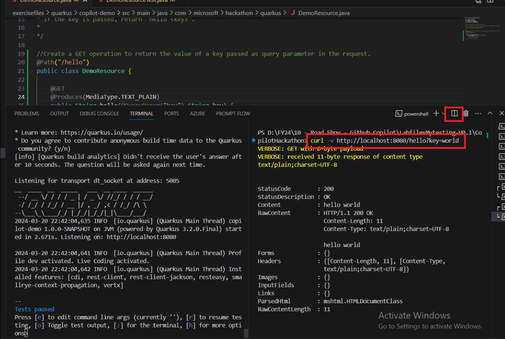

**Lab 05 - Build a REST API using Quarkus with the help of GitHub
CopilotGoal**

The goal of this lab is to learn how to use GitHub Copilot, using an
tasks that consists of building a REST API
using [*Quarkus*](https://quarkus.io/).

We have created a Quarkus project with some files already created, you
can find the project in the folder **exercisefiles/quarkus**.

Let's start copiloting!!!

**Task 1 - Create the code to handle a simple GET request**

Move to the 'DemoResource.java' file and start writing the code to
handle a simple GET request.

1.  In this first step, we have provided a comment that describes the
    code you need to generate. Just press enter and wait a couple of
    seconds.

2.  Copilot will generate the code for you.If you are not happy with the
    code press Ctrl +Enter and it will suggest multiple code options.

> 

3.  . If you are not happy with the code generated, you can press enter
    again and Copilot will generate a new code

> 
>
> 
>
> 
>
> 5\. Go to **test/java/com/Microsoft/hackthon/quarkus/** and click on
> **DemoResourceTest.java**. There is already a unit test implemented
> for this task.
>
> 
>
> 6\. Click on **Terminal -&gt; New Terminal.**
>
> 
>
> 7\. Select **Gitbash**.
>
> 
>
> 8\. Run !!cd exercisefiles/quarkus/copilot-demo/!! command.
>
> 
>
> 9\. You can run it using the command !!mvn test!! before and after to
> validate that the code generated by Copilot is correct.
>
> 
>
> 
>
> 

7\. After every task, feel free to package and run your application to
test it.

Package: !!mvn package!!

8\. Run: !!mvn quarkus:dev!!

10\. Click on Split terminal and enter the command in the 2^(nd)
terminal and run

 !!curl -v <http://localhost:8080/hello?key=world>!!

!!curl <http://localhost:8080/hello>!!

!!curl <http://localhost:8080/hello?key=world>!!

**Task 2 : Dates comparison**

New operation under /diffdates that calculates the difference between
two dates. The operation should receive two dates as parameter in format
dd-MM-yyyy and return the difference in days.

1.  Type comment !!// New operation under /diffdates that calculates the
    difference between two dates. The operation should receive two dates
    as parameter in format dd-MM-yyyy and return the difference in
    days.!! and press Enter

2.  Press tab and again Tab to accept the code.

> 

3.  Open DemoResourceTest.java file, create a unit test that validates
    the operation. Add !!//Create a unit test to validate /diffdates
    that calculates the difference between two dates!! and then press
    Enter.

4.  Press tab to accept the code.You can also user below code.

package com.microsoft.hackathon.quarkus;

import jakarta.ws.rs.GET;

import jakarta.ws.rs.Path;

import jakarta.ws.rs.Produces;

import jakarta.ws.rs.QueryParam;

import jakarta.ws.rs.client.Client;

import jakarta.ws.rs.client.ClientBuilder;

import jakarta.ws.rs.client.WebTarget;

import jakarta.ws.rs.core.MediaType;

import jakarta.ws.rs.core.Response;

import java.io.File;

import java.io.FileInputStream;

import java.io.IOException;

import java.io.InputStream;

import java.net.URL;

import java.nio.file.Files;

import java.nio.file.Paths;

import java.text.SimpleDateFormat;

import java.util.ArrayList;

import java.util.Date;

import java.util.List;

import java.util.Objects;

import com.fasterxml.jackson.databind.JsonNode;

import com.fasterxml.jackson.databind.ObjectMapper;

import com.fasterxml.jackson.databind.node.ObjectNode;

import io.quarkus.fs.util.ZipUtils;

/\*

\* The Demo resource should be mapped to the root path.

\*

\* Create a GET operation to return the value of a key passed as query
parameter in the request.

\*

\* If the key is not passed, return "key not passed".

\* If the key is passed, return "hello &lt;key&gt;".

\*

\*/

@Path("/")

public class DemoResource {

@GET

@Path("/hello")

@Produces(MediaType.TEXT\_PLAIN)

public String hello(@QueryParam("key") String key) {

if (key == null) {

return "key not passed";

} else {

return "hello " + key;

}

}

// New operation under /diffdates that calculates the difference between
two dates. The operation should receive two dates as parameter in format
dd-MM-yyyy and return the difference in days.

@GET

@Path("/diffdates")

@Produces(MediaType.TEXT\_PLAIN)

public String diffdates(@QueryParam("date1") String date1,
@QueryParam("date2") String date2) {

Objects.requireNonNull(date1, "date1 must not be null");

Objects.requireNonNull(date2, "date2 must not be null");

try {

SimpleDateFormat dateFormat = new SimpleDateFormat("dd-MM-yyyy");

Date date1Obj = dateFormat.parse(date1);

Date date2Obj = dateFormat.parse(date2);

long diffMillis = Math.abs(date1Obj.getTime() - date2Obj.getTime());

long diffDays = diffMillis / (24 \* 60 \* 60 \* 1000);

return String.valueOf(diffDays);

} catch (Exception e) {

return "invalid date format";

}

}

5.  Open Terminal and run !!**mvn test!!** command.

8\. Package the solution by running the command !!mvn package!!

9\. Run: !!mvn quarkus:dev or mvn compile quarkus:dev!!

10\. split terminal and run **curl -v http://localhost:8080/diffdates**

**Task 3 : Validate the format of a spanish phone**

Validate the format of a spanish phone number (+34 prefix, then 9
digits, starting with 6, 7 or 9). The operation should receive a phone
number as parameter and return true if the format is correct, false
otherwise.

1.  Type !!//Validate the format of a spanish phone number (+34 prefix,
    then 9 digits, starting with 6, 7 or 9). The operation should
    receive a phone number as parameter and return true if the format is
    correct, false otherwise!! and press Enter. Press tab to accept the
    Coilot suggest code.

2.  !!// write unit test to Validate the format of a spanish phone
    number (+34 prefix, then 9 digits, starting with 6, 7 or 9). The
    operation should receive a phone number as parameter and return true
    if the format is correct, false otherwise!! and press Enter. Press
    tab to accept the unit tests suggested by copilot

3.  Open the terminal and run !!mvn test!!.

4.  Run !!mvn package!!

5.  Run !!mvn quarkus:dev!!

6.  click on split terminal and run in one of the terminal -

> !!curl -v http://localhost:8080/validatephone?phone=+34866666666!!
>
> !!curl -v http://localhost:8080/validatephone?phone=+34666666667!!
>
> !!curl -v http://localhost:8080/validatephone?phone=+34666666666!!

**Task 4 : Validate the format of a spanish DNI**

Validate the format of a spanish DNI (8 digits and 1 letter). The
operation should receive a DNI as parameter and return true if the
format is correct, false otherwise.

1.  Type !!// Validate the format of a spanish DNI (8 digits and 1
    letter). The operation should receive a DNI as parameter and return
    true if the format is correct, false otherwise.!! and press Enter.
    Press tab to accept the Copilot suggest code.

2.  Switch to **CopilotDemoApplicationTests.java**. To write a unit test
    to test for the above function, add !!//Write unit test to Validate
    the format of a spanish DNI (8 digits and 1 letter). The operation
    should receive a DNI as parameter and return true if the format is
    correct, false otherwise.!! Press Enter. Press the tab to accept the
    code.

3.  Open terminal and run !!mvn test!!

4.  Run !!mvn package!!

5.  Run: !!mvn quarkus:dev!!

6.  Test: !!curl -v
    <http://localhost:8080/hello/validatedni?dni=12345678A>!!

**Task 5: From color name to hexadecimal code**

Based on the existing colors.json file under resources, given the name
of the color as path parameter, return the hexadecimal code. If the
color is not found, return 404

Hint: Use TDD. Start by creating the unit test and then implement the
code.

1.  Type !!// Based on the existing colors.json file under resources,
    given the name of the color as path parameter, return the
    hexadecimal code. If the color is not found, return 404.!! and press
    Enter. Press tab to accept the Copilot suggest code.

2.  Switch to **CopilotDemoApplicationTests.java**. To write a unit test
    to test for the above function, add !!//Write unit test to Based on
    the existing colors.json file under resources, given the name of the
    color as path parameter, return the hexadecimal code. If the color
    is not found, return 404.!! Press Enter. Press the tab to accept the
    code.

3.  Run !!mvn test!!

4.  Run !!mvn package!!

5.  Run:!! mvn quarkus:dev!!

6.  Test: !!curl -v http://localhost:8080/hello/color?color=red!!

**Task 6 : Jokes creator**

Create a new operation that call the
API [*https://api.chucknorris.io/jokes/random*](https://api.chucknorris.io/jokes/random) and
return the joke.

1.  Type !!// Create a new operation that call the
    API [*https://api.chucknorris.io/jokes/random*](https://api.chucknorris.io/jokes/random) and
    return the joke.!! and press Enter. Press tab to accept the Copilot
    suggest code.

2. Press tab to accept the code

2.  Switch to **CopilotDemoApplicationTests.java**. To write a unit test
    to test for the above function, add !!//Create a new operation that
    call the
    API [*https://api.chucknorris.io/jokes/random*](https://api.chucknorris.io/jokes/random) and
    return the joke.!! Press Enter. Press the tab to accept the code.

1.  Press tab to accept the code.

2.  Click on Terminal -&gt; New Terminal -&gt;Gitbash and run below
    commands

> !!cd exercisefiles/quarkus/copilot-demo/!!
>
> !!mvn test!!

3.  Run !!mvn package!! to package your application.

4.  Run: !!mvn quarkus:dev!!

5.  Test: !!curl -v http://localhost:8080/hello/joke!!

**Task 7 : URL parsing**

Given a url as query parameter, parse it and return the protocol, host,
port, path and query parameters. The response should be in Json format.

1.  Type !!//Given a url as query parameter, parse it and return the
    protocol, host, port, path and query parameters. The response should
    be in Json format.!! and press Enter. Press tab to accept the
    Copilot suggest code.

2.  Switch to **CopilotDemoApplicationTests.java**. To write a unit test
    to test for the above function, add !!//Write unit test for Given a
    url as query parameter, parse it and return the protocol, host,
    port, path and query parameters. The response should be in Json
    format.!! Press Enter. Press the tab to accept the code.

3.  Run !!mvn test!!

4.  Run !!mvn package!! to package your application.

5.  Run !!mvn quarkus:dev!!

6.  Click on split terminal and run !!curl -v
    <http://localhost:8080/hello/parseurl?url=https://www.google.com/search?q=quarkus>!!

**Task 9 : Word counting**

Given the path of a file and count the number of occurrence of a
provided word. The path and the word should be query parameters. The
response should be in Json format.

1.  Type !!//Given the path of a file and count the number of occurrence
    of a provided word. The path and the word should be query
    parameters. The response should be in Json format.!! and press
    Enter. Press tab to accept the Copilot suggest code.

2.  Switch to **CopilotDemoApplicationTests.java**. To write a unit test
    to test for the above function, add !!//Write unit test to Given the
    path of a file and count the number of occurrence of a provided
    word. The path and the word should be query parameters. The response
    should be in Json format.!! Press Enter. Press the tab to accept the
    code.

3.  Open **Terminal** and run !!mvn test!!

4.  Run !!mvn package!! to package your application.

5.  Run: !!mvn quarkus:dev!!

6.  Test: !!curl
    <http://localhost:8080/hello/countword?path=/tmp/test.txt&word=hello>!!

You can ask GitHub copilot for curl command for your project.

**Task 10 : Containerize the application**

Use the Dockerfile provided to create a docker image of the application.
In this case, the full content is provided, but in order build, run and
test the docker image, you will use Copilot as well to generate the
commands.

I have created a DOCKER.md file where we will document the steps to
build the application (native), build the container image, run the
container and test the container.

1.  In Visual Studio code, press **Ctrl +Shit + X** Search for
    **Docker** and install it.

2.  Double-click on **Desktop Docker** and sing in with your Docker
    account.

3.  Press **Ctrl +Alt+I** to open the **Github Copilot chat**. Ask your
    Copilot !! how to build the container image, run the container, and
    test the container with the provided Dockerfile!!

4.  Follow the insutruction of Copilot.Build the application: Run the
    following command in your terminal:

!!./mvnw package -Pnative -Dquarkus.native.container-build=true!!

5.  **Build the Docker image:** Assuming your Dockerfile is named
    **Dockerfile.native-micro**, you can use the following command:

!!docker build -f Dockerfile.native-micro -t my-app .!!

6.  This command tells Docker to build an image using the Dockerfile
    named \`Dockerfile.native-micro\` in the current directory (\`.\` at
    the end of the command), and to tag the resulting image with the
    name \`my-app\`.

7.  Run the Docker image: After the image is built, you can run it with
    the \`docker run\` command:

!!docker run -p 8080:8080 my-app!!

This command tells Docker to run a container from the \`my-app\` image,
and to map port 8080 in the container to port 8080 on the host machine.

6.  \*\*Test the application\*\*: Finally, to test if your application
    is running correctly, you can send a request to
    \`http://localhost:8080\` in your browser or using a tool like
    \`curl\`:

!!curl http://localhost:8080!!

This command sends a GET request to your application and prints the
response. If your application is running correctly, you should see the
expected response.

Please note that these commands should be run in your terminal, not
within your Java application code.
